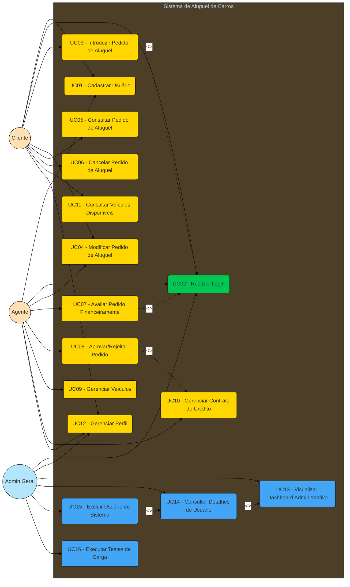
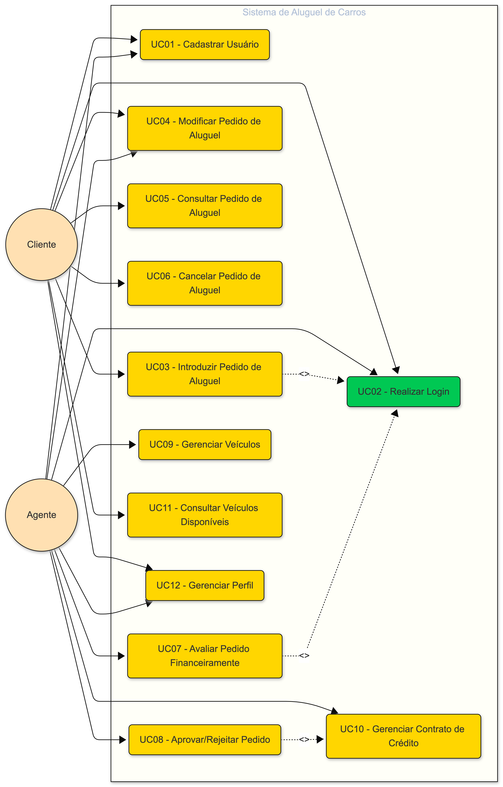

# Diagrama de Casos de Uso — Sistema de Aluguel de Carros

## 1. Atores

| Ator       | Descrição                                                                                   |
|------------|---------------------------------------------------------------------------------------------|
| **Cliente**     | Usuário individual cadastrado que pode criar, modificar, consultar e cancelar pedidos de aluguel. |
| **Agente**      | Empresa cadastrada que pode modificar, avaliar financeiramente e aprovar/rejeitar pedidos.       |
| **Admin Geral** | Dono da empresa RentACar com acesso administrativo total: visualização de usuários, métricas e exclusão de contas. |
| **Sistema**     | Ator interno que realiza validações automáticas, notificações e controle de status.              |

---

## 2. Diagrama de Casos de Uso (Mermaid)

### Visualização do Diagrama

---

## 3. Especificação dos Casos de Uso

### UC01 — Cadastrar Usuário

| Campo             | Descrição                                                                                           |
|-------------------|-----------------------------------------------------------------------------------------------------|
| **Ator Principal** | Cliente / Agente                                                                                   |
| **Pré-condição**   | Nenhuma                                                                                            |
| **Pós-condição**   | Usuário cadastrado no sistema com perfil completo                                                  |
| **Fluxo Principal** | 1. Usuário acessa a página de cadastro.   2. Seleciona o tipo de conta (Cliente ou Agente).   3. Preenche os dados obrigatórios.   4. Sistema valida os dados (CPF/CNPJ, e-mail único).   5. Sistema cria a conta e redireciona para login. |
| **Fluxo Alternativo** | 3a. Dados inválidos → Sistema exibe mensagens de erro e solicita correção.   4a. CPF/CNPJ ou e-mail já cadastrado → Sistema informa duplicidade. |

**Dados do Cliente:** RG, CPF, Nome, Endereço, Profissão, Entidades Empregadoras (máx. 3) com rendimentos.

**Dados do Agente:** CNPJ, Razão Social, Endereço, E-mail, Telefone.

---

### UC02 — Realizar Login

| Campo             | Descrição                                                                      |
|-------------------|--------------------------------------------------------------------------------|
| **Ator Principal** | Cliente / Agente                                                              |
| **Pré-condição**   | Usuário cadastrado no sistema                                                 |
| **Pós-condição**   | Usuário autenticado com token JWT válido                                      |
| **Fluxo Principal** | 1. Usuário informa e-mail e senha.   2. Sistema valida credenciais.   3. Sistema gera token JWT e redireciona ao dashboard correspondente ao perfil (Cliente, Agente ou Admin). |
| **Fluxo Alternativo** | 2a. Credenciais inválidas → Sistema exibe erro de autenticação.            |

---

### UC03 — Introduzir Pedido de Aluguel

| Campo             | Descrição                                                                                                         |
|-------------------|-------------------------------------------------------------------------------------------------------------------|
| **Ator Principal** | Cliente                                                                                                          |
| **Pré-condição**   | Cliente autenticado; veículo disponível no sistema                                                               |
| **Pós-condição**   | Pedido de aluguel criado com status PENDENTE                                                                     |
| **Fluxo Principal** | 1. Cliente consulta veículos disponíveis.   2. Seleciona veículo e período desejado.   3. Sistema calcula valor total.   4. Cliente confirma o pedido.   5. Sistema registra o pedido com status PENDENTE. |
| **Fluxo Alternativo** | 2a. Veículo indisponível para o período → Sistema notifica e sugere alternativas.   4a. Cliente cancela antes de confirmar → Pedido não é criado. |

---

### UC04 — Modificar Pedido de Aluguel

| Campo             | Descrição                                                                                                         |
|-------------------|-------------------------------------------------------------------------------------------------------------------|
| **Ator Principal** | Cliente / Agente                                                                                                 |
| **Pré-condição**   | Pedido existente com status que permita modificação (PENDENTE ou EM_ANÁLISE)                                     |
| **Pós-condição**   | Pedido atualizado com novos dados                                                                                |
| **Fluxo Principal** | 1. Usuário acessa detalhes do pedido.   2. Modifica dados permitidos (datas, veículo).   3. Sistema recalcula valores.   4. Sistema salva alterações. |
| **Fluxo Alternativo** | 1a. Pedido em status não modificável → Sistema bloqueia edição.                                               |

---

### UC05 — Consultar Pedido de Aluguel

| Campo             | Descrição                                                                          |
|-------------------|------------------------------------------------------------------------------------|
| **Ator Principal** | Cliente                                                                           |
| **Pré-condição**   | Cliente autenticado                                                               |
| **Pós-condição**   | Lista de pedidos exibida ao cliente                                               |
| **Fluxo Principal** | 1. Cliente acessa área "Meus Pedidos".   2. Sistema lista pedidos com filtros de status.   3. Cliente pode visualizar detalhes de cada pedido. |

---

### UC06 — Cancelar Pedido de Aluguel

| Campo             | Descrição                                                                                      |
|-------------------|------------------------------------------------------------------------------------------------|
| **Ator Principal** | Cliente                                                                                       |
| **Pré-condição**   | Pedido existente com status PENDENTE ou EM_ANÁLISE                                            |
| **Pós-condição**   | Pedido com status CANCELADO; veículo liberado                                                 |
| **Fluxo Principal** | 1. Cliente acessa detalhes do pedido.   2. Solicita cancelamento.   3. Sistema confirma a ação.   4. Sistema atualiza status para CANCELADO e libera veículo. |
| **Fluxo Alternativo** | 2a. Pedido já aprovado/executado → Sistema impede cancelamento direto.                     |

---

### UC07 — Avaliar Pedido Financeiramente

| Campo             | Descrição                                                                                                         |
|-------------------|-------------------------------------------------------------------------------------------------------------------|
| **Ator Principal** | Agente                                                                                                           |
| **Pré-condição**   | Agente autenticado; pedido com status PENDENTE                                                                   |
| **Pós-condição**   | Pedido com análise financeira registrada, status atualizado para EM_ANÁLISE ou APROVADO/REJEITADO                |
| **Fluxo Principal** | 1. Agente acessa lista de pedidos pendentes.   2. Seleciona pedido para avaliação.   3. Analisa dados financeiros do cliente (rendimentos, empregadores).   4. Registra parecer financeiro (aprovado/rejeitado com observações).   5. Sistema atualiza status do pedido. |

---

### UC08 — Aprovar/Rejeitar Pedido

| Campo             | Descrição                                                                                      |
|-------------------|------------------------------------------------------------------------------------------------|
| **Ator Principal** | Agente                                                                                        |
| **Pré-condição**   | Análise financeira positiva registrada                                                        |
| **Pós-condição**   | Contrato de aluguel executado ou pedido rejeitado                                             |
| **Fluxo Principal** | 1. Agente visualiza pedidos com análise financeira positiva.   2. Aprova a execução do contrato.   3. Sistema atualiza status para APROVADO.   4. (Extende) Se necessário, associa contrato de crédito. |
| **Fluxo Alternativo** | 2a. Agente rejeita → Status atualizado para REJEITADO.                                    |

---

### UC09 — Gerenciar Veículos

| Campo             | Descrição                                                                              |
|-------------------|----------------------------------------------------------------------------------------|
| **Ator Principal** | Agente                                                                                |
| **Pré-condição**   | Agente autenticado                                                                    |
| **Pós-condição**   | Veículo cadastrado/atualizado/removido do sistema                                     |
| **Fluxo Principal** | 1. Agente acessa gerenciamento de veículos.   2. Cadastra novo veículo com: matrícula, ano, marca, modelo, placa, tipo de propriedade.   3. Sistema valida e registra o veículo. |

---

### UC10 — Gerenciar Contrato de Crédito

| Campo             | Descrição                                                                                                     |
|-------------------|---------------------------------------------------------------------------------------------------------------|
| **Ator Principal** | Agente                                                                                                       |
| **Pré-condição**   | Pedido de aluguel aprovado                                                                                   |
| **Pós-condição**   | Contrato de crédito criado e associado ao pedido                                                             |
| **Fluxo Principal** | 1. Agente acessa pedido aprovado.   2. Cria contrato de crédito com: valor, taxa de juros, parcelas, banco agente.   3. Sistema vincula contrato ao pedido de aluguel. |

---

### UC11 — Consultar Veículos Disponíveis

| Campo             | Descrição                                                                  |
|-------------------|----------------------------------------------------------------------------|
| **Ator Principal** | Cliente                                                                   |
| **Pré-condição**   | Cliente autenticado                                                       |
| **Pós-condição**   | Lista de veículos disponíveis exibida                                     |
| **Fluxo Principal** | 1. Cliente acessa catálogo de veículos.   2. Filtra por marca, modelo, ano.   3. Visualiza detalhes e disponibilidade. |

---

### UC12 — Gerenciar Perfil

| Campo             | Descrição                                                                  |
|-------------------|----------------------------------------------------------------------------|
| **Ator Principal** | Cliente / Agente / Admin Geral                                            |
| **Pré-condição**   | Usuário autenticado                                                       |
| **Pós-condição**   | Dados do perfil atualizados                                               |
| **Fluxo Principal** | 1. Usuário clica no ícone de perfil na barra de navegação lateral.   2. Sistema exibe modal de edição com campos específicos por perfil.   3. Usuário modifica dados permitidos.   4. Sistema valida e persiste alterações. |

**Campos editáveis por perfil:**
- **Cliente:** Nome, profissão, endereço (com busca de CEP), empregadores (com máscara de telefone e moeda).
- **Agente:** Razão social, telefone (com máscara), endereço (com busca de CEP).
- **Admin Geral:** Nome.
- **Campos somente leitura:** E-mail, CPF, RG, CNPJ (conforme o perfil).

---

### UC13 — Visualizar Painel de Usuários

| Campo             | Descrição                                                                  |
|-------------------|----------------------------------------------------------------------------|
| **Ator Principal** | Admin Geral                                                               |
| **Pré-condição**   | Admin autenticado                                                         |
| **Pós-condição**   | Painel com métricas e listagem de usuários exibido                         |
| **Fluxo Principal** | 1. Admin acessa a seção "Usuários" na sidebar.   2. Sistema exibe métricas: total de clientes, total de agentes, total de veículos, total de pedidos e pedidos ativos.   3. Sistema lista todos os usuários (clientes e agentes) com busca e filtro por tipo.   4. Admin pode acessar detalhes de cada usuário ou excluí-lo. |

---

### UC14 — Consultar Detalhes de Usuário

| Campo             | Descrição                                                                  |
|-------------------|----------------------------------------------------------------------------|
| **Ator Principal** | Admin Geral                                                               |
| **Pré-condição**   | Admin autenticado; usuário existente no sistema                            |
| **Pós-condição**   | Detalhes completos do usuário exibidos                                     |
| **Fluxo Principal** | 1. Admin seleciona um usuário na listagem do dashboard.   2. Sistema verifica o tipo de usuário (Cliente ou Agente).   3a. **Cliente:** Exibe dados pessoais, endereço, empregadores, rendimentos e histórico de pedidos com status.   3b. **Agente:** Exibe dados da empresa, endereço, lista de veículos cadastrados e pedidos associados. |
| **Fluxo Alternativo** | 2a. Usuário não encontrado → Sistema exibe mensagem de erro.            |

---

### UC15 — Excluir Usuário do Sistema

| Campo             | Descrição                                                                  |
|-------------------|----------------------------------------------------------------------------|
| **Ator Principal** | Admin Geral                                                               |
| **Pré-condição**   | Admin autenticado; usuário alvo não é o próprio admin                      |
| **Pós-condição**   | Usuário removido do sistema                                                |
| **Fluxo Principal** | 1. Admin seleciona a opção de exclusão de um usuário.   2. Sistema solicita confirmação.   3. Admin confirma a exclusão.   4. Sistema remove o usuário e atualiza a listagem. |
| **Fluxo Alternativo** | 1a. Admin tenta excluir a si mesmo → Sistema bloqueia a operação.   3a. Admin cancela → Usuário não é excluído. |

---

### UC16 — Executar Testes de Carga Comparativos (MVC vs WebFlux)

| Campo             | Descrição                                                                  |
|-------------------|----------------------------------------------------------------------------|
| **Ator Principal** | Admin Geral                                                               |
| **Pré-condição**   | Admin autenticado                                                         |
| **Pós-condição**   | Testes executados com métricas comparativas exibidas em tempo real         |
| **Fluxo Principal** | 1. Admin acessa a seção "Testes de Carga" na sidebar.   2. Sistema exibe cards explicativos das arquiteturas Spring MVC (bloqueante) e Spring WebFlux (reativo).   3. Admin seleciona tipo de teste (Leitura de Banco, Simulação de I/O, Carga Concorrente ou Carga Mista).   4. Admin configura parâmetros: total de requisições, nível de concorrência e latência simulada.   5. Admin clica em "Executar Teste".   6. Sistema executa o teste primeiro no modo bloqueante (MVC) e depois no reativo (WebFlux), enviando progresso em tempo real via SSE.   7. Barras de progresso são atualizadas em tempo real para ambas as arquiteturas.   8. Ao concluir, sistema exibe: cards de métricas resumidas, tabela comparativa detalhada, barras de latência visual e análise textual automática dos resultados.   9. Admin pode executar novos testes; resultados anteriores são mantidos no histórico. |
| **Fluxo Alternativo** | 5a. Admin clica em "Parar Teste" durante a execução → SSE é cancelado e teste interrompido.   6a. Erro de conexão → Mensagem de erro exibida ao admin. |
