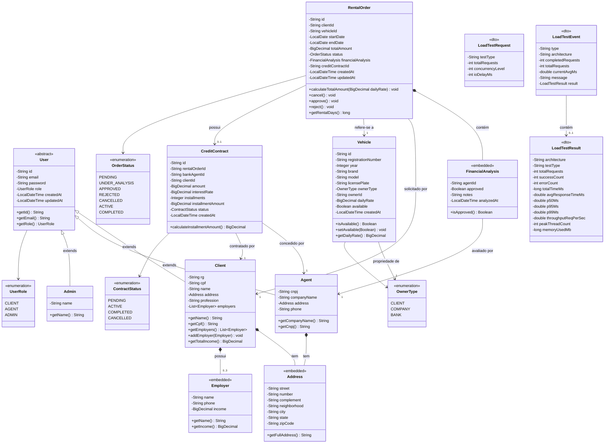

# Diagrama de Classes — Sistema de Aluguel de Carros

## 1. Diagrama de Classes (Mermaid)

### Visualização do Diagrama

---

## 2. Descrição das Classes

### 2.1 User (Abstrata)
Classe base para todos os usuários do sistema. Contém dados comuns de autenticação e controle.

| Atributo   | Tipo          | Descrição                            |
|------------|---------------|--------------------------------------|
| id         | String        | Identificador único (MongoDB ObjectId) |
| email      | String        | E-mail para autenticação (único)     |
| password   | String        | Senha criptografada (BCrypt)         |
| role       | UserRole      | Papel do usuário no sistema          |
| createdAt  | LocalDateTime | Data de criação do registro          |
| updatedAt  | LocalDateTime | Data da última atualização           |

---

### 2.2 Client (extends User)
Representa um usuário individual que aluga automóveis.

| Atributo   | Tipo            | Descrição                                  |
|------------|-----------------|--------------------------------------------|
| rg         | String          | Registro Geral                             |
| cpf        | String          | CPF (único, validado)                      |
| name       | String          | Nome completo                              |
| address    | Address         | Endereço completo (objeto embarcado)       |
| profession | String          | Profissão                                  |
| employers  | List\<Employer> | Entidades empregadoras (máximo 3)          |

---

### 2.3 Agent (extends User)
Representa uma empresa (agente) que avalia e gerencia pedidos.

| Atributo    | Tipo    | Descrição                          |
|-------------|---------|------------------------------------|
| cnpj        | String  | CNPJ (único, validado)             |
| companyName | String  | Razão social da empresa            |
| address     | Address | Endereço da empresa                |
| phone       | String  | Telefone de contato                |
---

### 2.4 Admin (extends User)
Representa o administrador geral (dono da empresa RentACar) com acesso administrativo total.

| Atributo | Tipo   | Descrição                          |
|----------|--------|------------------------------------|--------|
| name     | String | Nome do administrador              |
### 2.4 Admin (extends User)
Representa o administrador geral (dono da empresa RentACar) com acesso administrativo total.

| Atributo | Tipo   | Descrição                          |
|----------|--------|------------------------------------|--------|
| name     | String | Nome do administrador              |

---

### 2.5 Address (Embedded)
Objeto de valor que representa um endereço completo.

| Atributo     | Tipo   | Descrição         |
|--------------|--------|--------------------|
| street       | String | Logradouro         |
| number       | String | Número             |
| complement   | String | Complemento        |
| neighborhood | String | Bairro             |
| city         | String | Cidade             |
| state        | String | Estado (UF)        |
| zipCode      | String | CEP                |

---

### 2.6 Employer (Embedded)
Representa uma entidade empregadora do cliente.

| Atributo | Tipo       | Descrição                    |
|----------|------------|------------------------------|
| name     | String     | Nome da empresa empregadora  |
| phone    | String     | Telefone da empresa          |
| income   | BigDecimal | Rendimento auferido (R$)     |

---

### 2.7 Vehicle
Representa um automóvel disponível para aluguel.

| Atributo           | Tipo       | Descrição                                    |
|--------------------|------------|----------------------------------------------|
| id                 | String     | Identificador único                          |
| registrationNumber | String     | Matrícula do veículo                         |
| year               | Integer    | Ano de fabricação                            |
| brand              | String     | Marca do automóvel                           |
| model              | String     | Modelo do automóvel                          |
| licensePlate       | String     | Placa (única)                                |
| ownerType          | OwnerType  | Tipo de propriedade (Cliente/Empresa/Banco)  |
| ownerId            | String     | ID do proprietário                           |
| dailyRate          | BigDecimal | Valor da diária (R$)                         |
| available          | Boolean    | Indica se está disponível para aluguel       |
| createdAt          | LocalDateTime | Data de cadastro                          |

---

### 2.8 RentalOrder
Representa um pedido de aluguel de automóvel.

| Atributo          | Tipo              | Descrição                                 |
|-------------------|-------------------|-------------------------------------------|
| id                | String            | Identificador único                       |
| clientId          | String            | ID do cliente solicitante                 |
| vehicleId         | String            | ID do veículo solicitado                  |
| startDate         | LocalDate         | Data de início do aluguel                 |
| endDate           | LocalDate         | Data de término do aluguel                |
| totalAmount       | BigDecimal        | Valor total calculado                     |
| status            | OrderStatus       | Status atual do pedido                    |
| financialAnalysis | FinancialAnalysis | Análise financeira (embarcado, opcional)  |
| creditContractId  | String            | ID do contrato de crédito (opcional)      |
| createdAt         | LocalDateTime     | Data de criação                           |
| updatedAt         | LocalDateTime     | Data da última atualização                |

---

### 2.9 FinancialAnalysis (Embedded)
Representa a análise financeira realizada pelo agente.

| Atributo   | Tipo          | Descrição                          |
|------------|---------------|------------------------------------|
| agentId    | String        | ID do agente que realizou a análise|
| approved   | Boolean       | Resultado da análise               |
| notes      | String        | Observações do agente              |
| analyzedAt | LocalDateTime | Data/hora da análise               |

---

### 2.10 CreditContract
Representa um contrato de crédito associado a um aluguel.

| Atributo         | Tipo           | Descrição                              |
|------------------|----------------|----------------------------------------|
| id               | String         | Identificador único                    |
| rentalOrderId    | String         | ID do pedido de aluguel vinculado      |
| bankAgentId      | String         | ID do banco agente concedente          |
| clientId         | String         | ID do cliente contratante              |
| amount           | BigDecimal     | Valor do crédito                       |
| interestRate     | BigDecimal     | Taxa de juros (% ao mês)              |
| installments     | Integer        | Número de parcelas                     |
| installmentAmount| BigDecimal     | Valor de cada parcela                  |
| status           | ContractStatus | Status do contrato                     |
| createdAt        | LocalDateTime  | Data de criação                        |

---

## 3. Regras de Negócio

| Regra | Descrição |
|-------|-----------|
| RN-01 | Um cliente pode ter no máximo 3 entidades empregadoras. |
| RN-02 | O valor total do aluguel é calculado como: `dailyRate × número de dias`. |
| RN-03 | Apenas pedidos com status PENDENTE podem ser modificados pelo cliente. |
| RN-04 | Apenas pedidos com status PENDENTE ou EM_ANÁLISE podem ser cancelados. |
| RN-05 | A análise financeira só pode ser realizada por um agente. |
| RN-06 | Um contrato de crédito só pode ser criado para pedidos com análise financeira positiva. |
| RN-07 | A placa do veículo deve ser única no sistema. |
| RN-08 | CPF e CNPJ devem ser únicos e válidos. |
| RN-09 | O veículo fica indisponível enquanto vinculado a um pedido ativo (não cancelado/rejeitado). |
| RN-10 | O Admin Geral não pode excluir a si mesmo do sistema. |
| RN-11 | Apenas usuários com role ADMIN têm acesso aos endpoints administrativos (`/api/admin/**`). |
| RN-12 | O dashboard administrativo exibe métricas agregadas (total de clientes, agentes, veículos, pedidos e pedidos ativos). |
