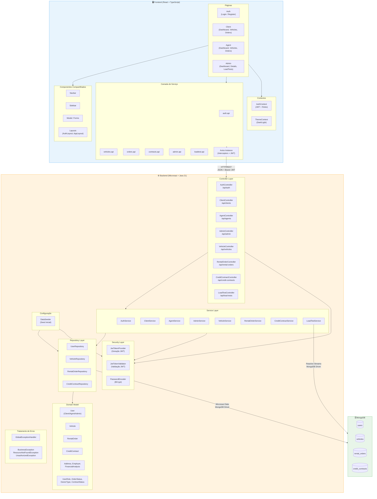

# Diagrama de Componentes do Sistema — RentACar

## 1. Visão Geral

O sistema RentACar é composto por três grandes componentes de implantação: **Frontend** (SPA React), **Backend** (API REST Micronaut) e **Banco de Dados** (MongoDB). O diagrama abaixo detalha os componentes internos de cada camada e suas dependências.

---

## 2. Diagrama de Componentes (Mermaid)



---

## 3. Descrição dos Componentes

### 3.1 Frontend (React + TypeScript + Vite)

| Componente | Responsabilidade |
|---|---|
| **Páginas (Pages)** | Telas principais organizadas por role: Auth, Client, Agent, Admin |
| **Componentes Compartilhados** | Navbar, Sidebar, Modal, Formulários reutilizáveis |
| **Camada de Serviço (API)** | Módulos de comunicação HTTP com o backend via Axios |
| **Contextos** | Gerenciamento de estado global (autenticação e tema) |

### 3.2 Backend (Micronaut + Java 21)

| Componente | Responsabilidade |
|---|---|
| **Controllers** | Exposição dos endpoints REST, validação de entrada, autorização via `@Secured` |
| **Services** | Lógica de negócio, orquestração de operações |
| **Security** | Geração/validação JWT, encoding de senhas com BCrypt |
| **Repositories** | Acesso a dados via Micronaut Data MongoDB (`@MongoRepository`) |
| **Domain Model** | Entidades persistidas (User, Vehicle, RentalOrder, CreditContract) e value objects |
| **Config** | Seed de dados iniciais no startup da aplicação |
| **Exception Handling** | Tratamento global de erros com respostas padronizadas |

### 3.3 Banco de Dados (MongoDB 7)

| Collection | Entidade | Descrição |
|---|---|---|
| `users` | User | Todos os usuários (Client, Agent, Admin) diferenciados pelo campo `role` |
| `vehicles` | Vehicle | Veículos disponíveis para aluguel |
| `rental_orders` | RentalOrder | Pedidos de aluguel com análise financeira embutida |
| `credit_contracts` | CreditContract | Contratos de crédito vinculados a pedidos aprovados |

---

## 4. Fluxos Principais

### 4.1 Autenticação
```
Frontend → AuthController → AuthService → UserRepository → MongoDB
                                        → JwtTokenProvider (gera token)
                                        → PasswordEncoder (valida senha)
```

### 4.2 Criação de Pedido de Aluguel
```
Frontend → RentalOrderController → RentalOrderService → RentalOrderRepository → MongoDB
                                                       → VehicleService (verifica disponibilidade)
                                                       → ClientService (valida cliente)
```

### 4.3 Teste de Carga (SSE)
```
Frontend → LoadTestController → LoadTestService
                               ├─ Sync: VehicleRepository + RentalOrderRepository (bloqueante)
                               └─ Reactive: MongoClient Reactive Streams (não-bloqueante)
           ← Server-Sent Events (Flux<Event<LoadTestEvent>>)
```
