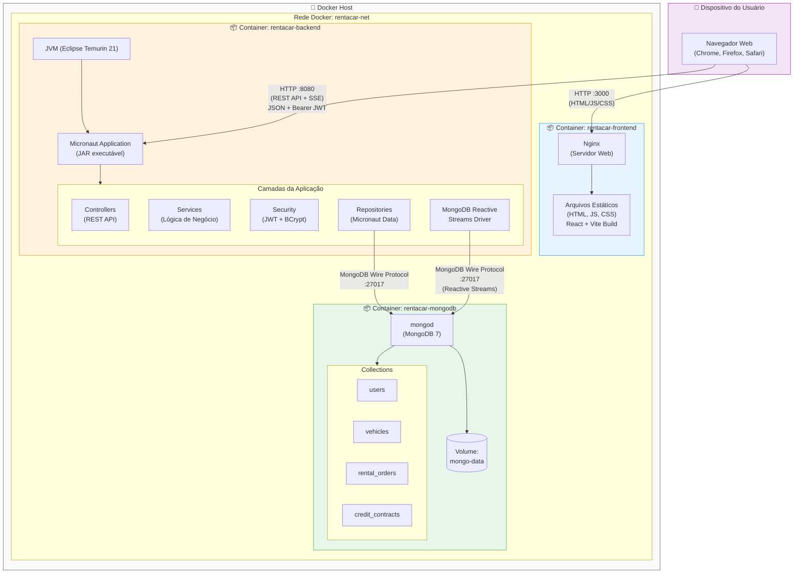
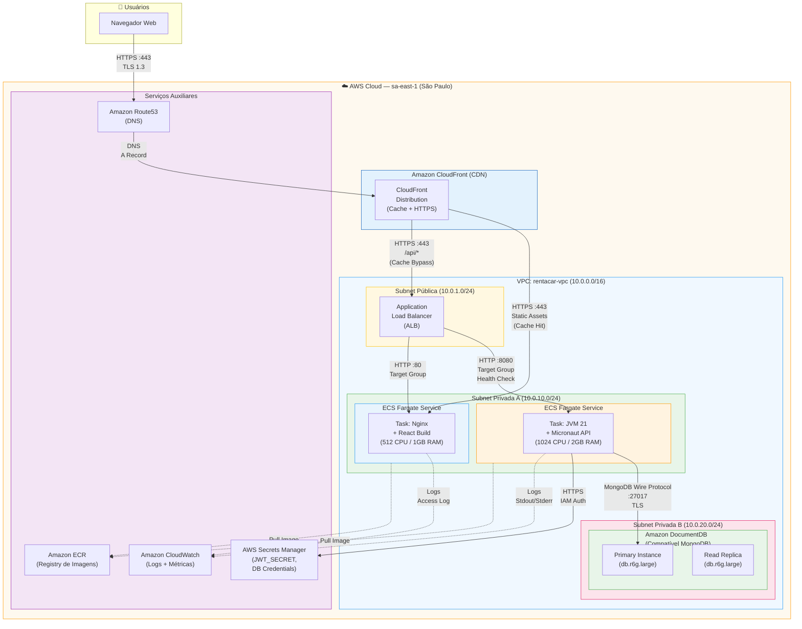

# Diagrama de Implantação — Sistema RentACar

## 1. Visão Geral

O sistema RentACar utiliza uma arquitetura de **três camadas** containerizada com Docker. Em ambiente local, os containers são orquestrados via Docker Compose. Em **produção**, a arquitetura é implantada na **AWS** utilizando serviços gerenciados: **ECS Fargate** para os containers, **Amazon DocumentDB** (compatível com MongoDB) para persistência, **Application Load Balancer (ALB)** para distribuição de tráfego e **Amazon CloudFront** como CDN para entrega do frontend.

---

## 2. Diagrama de Implantação — Ambiente Local (Docker Compose)



---

## 3. Diagrama de Implantação — Produção (AWS Cloud)



---

## 4. Nós de Implantação

### 4.1 Dispositivo do Usuário

| Componente | Descrição |
|---|---|
| **Navegador Web** | Qualquer navegador moderno com suporte a ES2020+, Fetch API e SSE |

### 4.2 Container Frontend (`rentacar-frontend`)

| Propriedade | Local | Produção (AWS) |
|---|---|---|
| **Imagem base** | `node` → `nginx` | `node` → `nginx` (via ECR) |
| **Porta** | 3000 → 80 | 80 (via ALB) |
| **Tecnologias** | React 18, TypeScript, Vite, TailwindCSS | Mesmo |
| **Compute** | Docker local | ECS Fargate (512 CPU / 1GB) |

### 4.3 Container Backend (`rentacar-backend`)

| Propriedade | Local | Produção (AWS) |
|---|---|---|
| **Imagem base** | `eclipse-temurin:21-jdk` → `21-jre` | Mesmo (via ECR) |
| **Porta** | 8080 | 8080 (via ALB Target Group) |
| **Framework** | Micronaut 4.7.6 | Mesmo |
| **Compute** | Docker local | ECS Fargate (1024 CPU / 2GB) |
| **Secrets** | `.env` / `docker-compose.yml` | AWS Secrets Manager |

### 4.4 Banco de Dados

| Propriedade | Local | Produção (AWS) |
|---|---|---|
| **Serviço** | MongoDB 7 (container) | Amazon DocumentDB |
| **Porta** | 27017 | 27017 (TLS) |
| **Persistência** | Volume Docker (`mongo-data`) | Storage gerenciado AWS |
| **Alta disponibilidade** | N/A | Primary + Read Replica |

---

## 5. Protocolos de Comunicação

| Origem | Destino | Protocolo | Porta | Descrição |
|---|---|---|---|---|
| Browser | CloudFront/Frontend | HTTPS (TLS 1.3) | 443 | Carrega SPA (HTML/JS/CSS) |
| Browser | CloudFront → ALB → Backend | HTTPS → HTTP | 443/8080 | Chamadas REST API com JWT + SSE |
| Backend | DocumentDB/MongoDB | MongoDB Wire Protocol + TLS | 27017 | Consultas e persistência (sync + reactive) |
| ECS Tasks | ECR | HTTPS | 443 | Pull de imagens Docker |
| Backend | Secrets Manager | HTTPS + IAM | 443 | Recuperação de secrets (JWT, DB credentials) |
| All Services | CloudWatch | HTTPS | 443 | Envio de logs e métricas |

---

## 6. Configuração Docker Compose (Local)

```yaml
services:
  mongodb:        # Porta 27017, volume mongo-data
  backend:        # Porta 8080, depende de mongodb
  frontend:       # Porta 3000, depende de backend

networks:
  rentacar-net:   # Bridge network para comunicação entre containers

volumes:
  mongo-data:     # Persistência do MongoDB
```

---

## 7. Infraestrutura AWS (Produção)

| Serviço AWS | Função | Justificativa |
|---|---|---|
| **ECS Fargate** | Compute serverless para containers | Sem gerenciamento de servidores, auto-scaling |
| **Application Load Balancer** | Roteamento de tráfego HTTP/HTTPS | Health checks, distribuição entre tasks |
| **Amazon DocumentDB** | Banco de dados compatível MongoDB | Gerenciado, alta disponibilidade, backups automáticos |
| **Amazon ECR** | Registry privado de imagens Docker | Integração nativa com ECS, scan de vulnerabilidades |
| **AWS Secrets Manager** | Gerenciamento de secrets | Rotação de secrets, integração com ECS task definitions |
| **Amazon CloudFront** | CDN e terminação TLS | Cache global de assets estáticos, certificado SSL/TLS |
| **Amazon CloudWatch** | Observabilidade | Logs centralizados, métricas, alarmes |
| **Amazon Route53** | DNS gerenciado | Resolução de domínio, health checks DNS |

---

## 8. Requisitos de Ambiente

| Requisito | Desenvolvimento | Produção |
|---|---|---|
| Docker | 20.10+ | — (ECS gerenciado) |
| Docker Compose | 2.0+ | — |
| JDK | 21 | 21 (Temurin, via imagem) |
| Node.js | 18+ | 20 (build via ECR) |
| Maven | 3.9+ | 3.9+ (build pipeline) |
| AWS CLI | — | 2.x |
| Conta AWS | — | Com permissões para ECS, DocumentDB, ALB, ECR, etc. |
