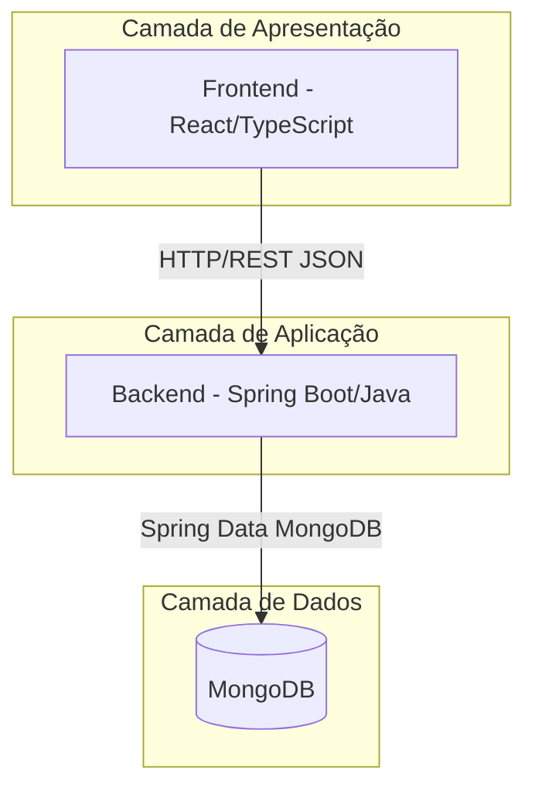
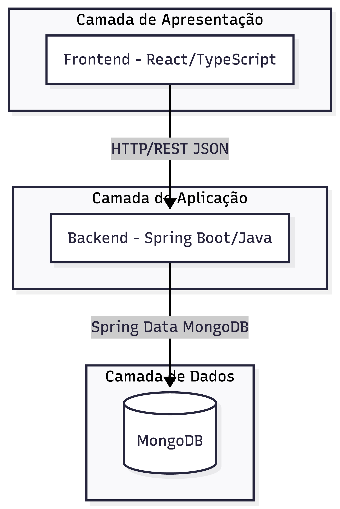
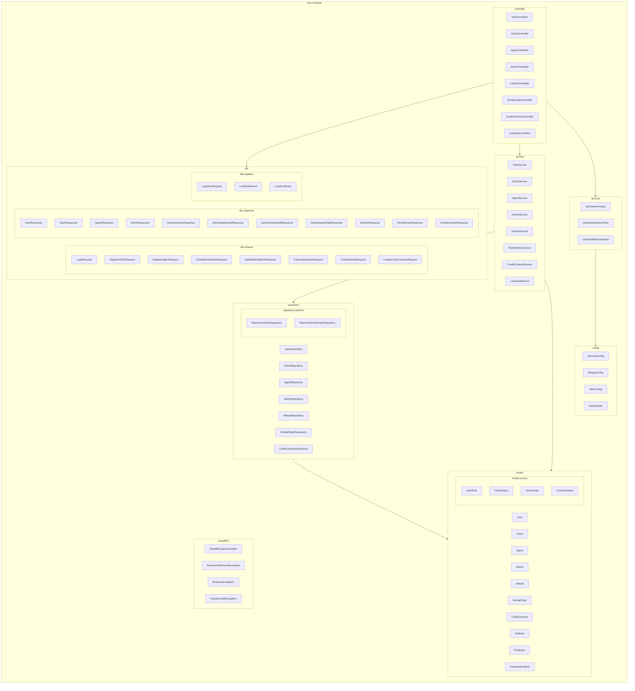
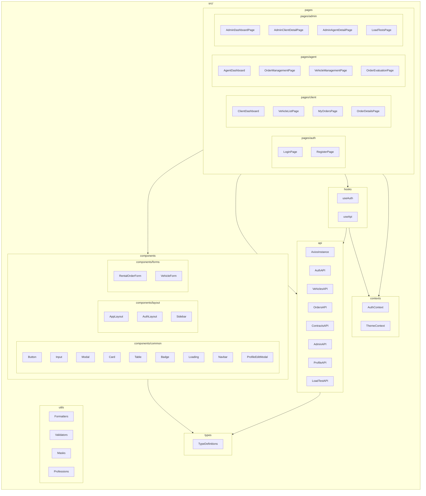

# Diagrama de Pacotes (Visão Lógica) — Sistema de Aluguel de Carros

## 1. Visão Geral da Arquitetura

O sistema segue uma arquitetura **cliente-servidor** com separação clara entre Frontend (SPA) e Backend (API REST), comunicando-se via HTTP/JSON. O banco de dados MongoDB é utilizado para persistência.



### Visualização do Diagrama — Visão Geral



---

## 2. Diagrama de Pacotes — Backend (Java/Spring Boot)



### Visualização do Diagrama — Backend


---

## 3. Diagrama de Pacotes — Frontend (React/TypeScript)



### Visualização do Diagrama — Frontend


---

## 4. Dependências entre Camadas

### Backend — Fluxo de Dependências

```
Controller → DTO (Request/Response)
Controller → Service
Service → Repository
Service → Model
Service → Exception
Repository → Model
Security → Config
Controller → Security (via annotations)
```

**Princípios aplicados:**
- **Inversão de Dependência (DIP):** Services dependem de abstrações (interfaces de repositórios).
- **Responsabilidade Única (SRP):** Cada camada tem responsabilidade bem definida.
- **Separação de Concerns:** Controllers não acessam repositórios diretamente.

### Frontend — Fluxo de Dependências

```
Pages → Components (UI reutilizável)
Pages → Hooks (lógica reutilizável)
Pages → API (chamadas HTTP)
Hooks → Contexts (estado global de auth)
Hooks → API
API → Types (tipagem strong)
Components → Types
```

**Princípios aplicados:**
- **Composição:** Componentes são compostos para formar páginas.
- **Custom Hooks:** Lógica de negócio encapsulada em hooks reutilizáveis.
- **Context API:** Estado de autenticação compartilhado globalmente.
- **Type Safety:** Tipagem estrita com TypeScript em toda a aplicação.

---

## 5. Responsabilidades das Camadas

| Camada (Backend)    | Responsabilidade                                                                 |
|---------------------|----------------------------------------------------------------------------------|
| **controller**      | Receber requisições HTTP, validar entrada, delegar para services, retornar DTOs  |
| **service**         | Implementar regras de negócio, orquestrar operações, gerenciar transações        |
| **repository**      | Abstrair acesso ao MongoDB via Spring Data                                       |
| **model**           | Representar entidades do domínio e objetos de valor                              |
| **dto**             | Transferir dados entre camadas sem expor entidades                               |
| **security**        | Autenticação JWT, autorização baseada em roles                                   |
| **config**          | Configurações do Spring (CORS, Security, MongoDB)                                |
| **exception**       | Tratamento centralizado de exceções com respostas padronizadas                   |

| Camada (Frontend)   | Responsabilidade                                                                 |
|---------------------|----------------------------------------------------------------------------------|
| **pages**           | Telas completas da aplicação, composição de componentes                          |
| **components**      | Elementos de UI reutilizáveis e stateless                                        |
| **api**             | Comunicação HTTP com o backend via Axios                                         |
| **contexts**        | Estado global compartilhado (autenticação)                                       |
| **hooks**           | Lógica reutilizável e efeitos colaterais                                         |
| **types**           | Definições TypeScript para tipagem forte                                         |
| **utils**           | Funções utilitárias (formatação, validação)                                      |
