# Diagrama de Casos de Uso

## Visualizacao renderizada

Fonte Mermaid: [diagrama-casos-de-uso.mmd](diagrama-casos-de-uso.mmd)

## 1. Objetivo academico do artefato

Este artefato modela os requisitos funcionais externos do Sistema de Moeda Estudantil sob a perspectiva UML de alto nivel, garantindo rastreabilidade entre atores, objetivos de negocio e servicos automatizados.

## 2. Fundamentacao teorica aplicada

### 2.1 Base conceitual UML

O diagrama segue a semantica de casos de uso da UML 2.x:

- **Ator**: papel externo que interage com o sistema (nao representa pessoa fisica especifica).
- **Caso de uso**: servico observavel que entrega valor para um ator.
- **Fronteira de sistema**: delimita o que pertence ao software e o que esta fora dele.

### 2.2 Heuristicas de Jacobson e Cockburn

Para manter granularidade correta:

- Casos de uso foram escritos no nivel de **objetivo de usuario**.
- Passos internos obrigatorios foram separados como casos de uso reutilizaveis via `<<include>>`.
- Regras de negocio transversais (notificacao e credito semestral) ficaram explicitadas como comportamento automatico.

### 2.3 Criterios de qualidade visual

Foram aplicados principios de legibilidade de diagramas:

1. Agrupamento por dominio funcional (Acesso, Reconhecimento, Beneficios).
2. Minimizacao de cruzamento de arestas por orientacao em faixas.
3. Uniformizacao semantica de cores:
	- azul claro para atores,
	- branco para casos de uso de negocio,
	- amarelo claro para casos automaticos.

## 3. Convencoes de notacao adotadas

| Elemento | Convencao no Mermaid | Significado |
| --- | --- | --- |
| Ator | retangulo arredondado azul | Papel externo ao sistema |
| Caso de uso de negocio | elipse branca | Objetivo funcional primario |
| Caso de uso automatico | elipse bege | Rotina executada pelo sistema |
| Aresta solida | `-->` | Associacao ator-caso de uso |
| Aresta tracejada | `-. "<<include>>" .->` | Reuso obrigatorio de comportamento |

## 4. Processo metodologico de construcao

1. Levantamento dos objetivos por ator.
2. Identificacao de casos de uso primarios que entregam valor.
3. Separacao de comportamentos obrigatorios internos (`<<include>>`).
4. Agrupamento em pacotes funcionais para reduzir ambiguidade.
5. Validacao de completude contra requisitos da release.

## 5. Catalogo completo dos casos de uso

| ID | Caso de uso | Ator primario | Pre-condicao | Fluxo principal resumido | Pos-condicao | Rastreabilidade API |
| --- | --- | --- | --- | --- | --- | --- |
| UC01 | Cadastrar aluno | Aluno | Instituicao disponivel para vinculacao | Informa dados pessoais e academicos; sistema valida unicidade | Conta de aluno criada | `POST /api/students/register` |
| UC02 | Autenticar por perfil | Aluno/Professor/Parceiro | Conta previamente cadastrada | Informa credencial e perfil; sistema valida identidade | Sessao autenticada com token | `POST /api/auth/login` |
| UC03 | Consultar saldo e extrato | Aluno/Professor | Sessao valida | Sistema retorna saldo e historico ordenado | Dados financeiros exibidos | `GET /api/students/me/statement`, `GET /api/professors/me/statement` |
| UC04 | Enviar moedas | Professor | Sessao de professor valida e saldo suficiente | Seleciona aluno, quantidade e mensagem | Transferencia registrada no ledger | `POST /api/professors/me/transfer` |
| UC05 | Registrar mensagem de reconhecimento | Sistema (include de UC04) | UC04 acionado | Mensagem enviada pelo professor e persistida na transacao | Mensagem auditavel no extrato | parte de `POST /api/professors/me/transfer` |
| UC06 | Notificar aluno por email | Sistema (include de UC04) | UC04 concluido | Sistema dispara notificacao para aluno | Aluno recebe confirmacao de reconhecimento | parte de `POST /api/professors/me/transfer` |
| UC07 | Cadastrar empresa parceira | Empresa parceira | Nenhuma | Informa dados de empresa e contato; sistema valida unicidade | Conta de parceiro criada | `POST /api/partners/register` |
| UC08 | Gerenciar vantagens | Empresa parceira | Sessao de parceiro valida | Cria, altera, ativa/desativa ou remove vantagem | Catalogo do parceiro atualizado | `POST/PUT/DELETE /api/benefits*` |
| UC09 | Listar catalogo publico | Aluno | Nenhuma (acesso publico permitido) | Consulta vantagens ativas | Catalogo exibido para descoberta | `GET /api/benefits` |
| UC10 | Resgatar vantagem | Aluno | Sessao valida e saldo suficiente | Seleciona vantagem e confirma resgate | Saldo debitado e transacao registrada | `POST /api/redemptions` |
| UC11 | Gerar cupom unico | Sistema (include de UC10) | UC10 concluido | Sistema gera codigo unico de troca | Cupom vinculado ao resgate | parte de `POST /api/redemptions` |
| UC12 | Notificar parceiro por email | Sistema (include de UC10) | UC10 concluido | Sistema envia cupom e dados do resgate ao parceiro | Parceiro apto a validar troca | parte de `POST /api/redemptions` |
| UC13 | Creditar moedas semestrais | Sistema (agendado) | Periodo semestral e chave ainda nao creditada | Rotina de alocacao processa professores elegiveis | Saldo de professor atualizado sem duplicidade | rotina `SemesterAllocationService` |

## 6. Regras de negocio explicitadas no diagrama

1. Professor so transfere moedas com saldo suficiente.
2. Resgate exige vantagem ativa e saldo suficiente do aluno.
3. Parceiro gerencia apenas vantagens da propria conta.
4. Credito semestral e idempotente por professor e semestre.
5. Operacoes de transferencia e resgate incluem notificacoes obrigatorias.

## 7. Validacao de consistencia

Checklist aplicado:

- Cada ator possui pelo menos um objetivo de valor claro.
- Cada caso de uso possui pre-condicao e pos-condicao identificaveis.
- Casos automaticos foram separados para reforcar auditabilidade.
- Nao ha caso de uso "tecnico" sem valor funcional visivel.

## 8. Leitura guiada do diagrama

1. Ler da esquerda para a direita (atores para fronteira do sistema).
2. Percorrer os blocos funcionais de cima para baixo.
3. Verificar as setas tracejadas para entender comportamentos obrigatorios internos.
4. Consultar a tabela de rastreabilidade para conectar requisito, diagrama e endpoint.
