# Historias de Usuario

## Visualizacao renderizada

Fonte Mermaid: [mapa-historias.mmd](mapa-historias.mmd)

## 1. Objetivo academico do artefato

Consolidar o backlog funcional da release em formato de historias de usuario, com criterios de aceite verificaveis e rastreabilidade para regras de negocio e endpoints.

## 2. Fundamentacao teorica aplicada

### 2.1 Modelo de historia de usuario (Cohn)

As historias foram modeladas no formato:

> Como [ator], quero [objetivo], para [beneficio].

Este formato garante foco em valor, nao em tecnologia.

### 2.2 Regra INVEST

Cada historia foi revisada sob INVEST:

- **I**ndependent: historia pode ser planejada com autonomia relativa.
- **N**egotiable: detalhamento tecnico permanece ajustavel.
- **V**aluable: entrega beneficio explicito a um ator.
- **E**stimable: escopo passivel de estimativa.
- **S**mall: tamanho adequado para iteracao curta.
- **T**estable: criterios de aceite mensuraveis.

### 2.3 Story Mapping (Patton)

O mapa Mermaid organiza historias por **epicos** e **dependencias**, permitindo:

1. visao horizontal de jornada,
2. visao vertical de prioridade,
3. composicao objetiva da release MVP.

### 2.4 3Cs de uma historia de usuario

Cada historia e tratada como:

- **Card**: registro sintetico no backlog.
- **Conversation**: negociacao de detalhes funcionais.
- **Confirmation**: criterio de aceite formal (Given/When/Then).

## 3. Criterios de priorizacao da release

Foi utilizada uma matriz combinando valor de negocio, risco e dependencia:

- **MUST**: essencial para demonstracao funcional ponta a ponta.
- **SHOULD**: agrega valor, mas nao bloqueia operacao minima.

## 4. Backlog consolidado

| ID | Narrativa resumida | Prioridade | Valor primario | Dependencias |
| --- | --- | --- | --- | --- |
| HU-01 | Cadastro de aluno com vinculo institucional | MUST | Habilitar participacao no ecossistema | nenhuma |
| HU-02 | Login por perfil com token | MUST | Seguranca e segregacao de acesso | HU-01, HU-06 |
| HU-03 | Consulta de extrato e saldo | MUST | Transparencia financeira | HU-02 |
| HU-04 | Transferencia de moedas por professor | MUST | Reconhecimento academico formalizado | HU-02, HU-10 |
| HU-05 | Notificacao de recebimento ao aluno | SHOULD | Feedback imediato de reconhecimento | HU-04 |
| HU-06 | Cadastro de empresa parceira | MUST | Formacao do ecossistema de beneficios | nenhuma |
| HU-07 | CRUD de vantagens pelo parceiro | MUST | Operacao do catalogo de troca | HU-02, HU-06 |
| HU-08 | Resgate de vantagem com moedas | MUST | Conversao de merito em beneficio | HU-03, HU-07 |
| HU-09 | Notificacao de cupom para aluno e parceiro | MUST | Confirmacao operacional de resgate | HU-08 |
| HU-10 | Credito semestral de moedas ao professor | MUST | Sustentacao do ciclo de reconhecimento | nenhuma |

## 5. Especificacao detalhada e criterios Given/When/Then

### HU-01 Cadastro de aluno

**Historia:** Como aluno, quero cadastrar meus dados com instituicao para participar do programa de moedas.

**Criterios de aceite (Gherkin):**

- Given dados obrigatorios validos, When envio o cadastro, Then o sistema cria a conta de aluno.
- Given email ou CPF ja existente, When envio o cadastro, Then o sistema rejeita a operacao com mensagem de unicidade.

### HU-02 Login por perfil

**Historia:** Como usuario, quero autenticar por perfil para acessar funcionalidades corretas do meu papel.

**Criterios de aceite (Gherkin):**

- Given credencial valida para o perfil informado, When realizo login, Then recebo token de sessao.
- Given credencial invalida, When realizo login, Then o sistema responde com erro de autenticacao.

### HU-03 Consulta de extrato

**Historia:** Como aluno ou professor, quero consultar meu extrato para acompanhar movimentacoes.

**Criterios de aceite (Gherkin):**

- Given sessao autenticada, When consulto meu extrato, Then vejo saldo atual e transacoes ordenadas por data descrescente.
- Given sessao ausente, When consulto extrato, Then recebo resposta de autenticacao necessaria.

### HU-04 Envio de moedas

**Historia:** Como professor, quero enviar moedas com mensagem obrigatoria para reconhecer merito.

**Criterios de aceite (Gherkin):**

- Given saldo suficiente e dados validos, When confirmo transferencia, Then o sistema debita professor e credita aluno.
- Given valor menor ou igual a zero, When envio transferencia, Then a operacao e rejeitada por validacao.

### HU-05 Notificacao de recebimento

**Historia:** Como aluno, quero receber email quando ganhar moedas para acompanhar meus reconhecimentos.

**Criterios de aceite (Gherkin):**

- Given transferencia concluida, When evento e processado, Then o sistema envia notificacao ao aluno com professor, valor e mensagem.

### HU-06 Cadastro de parceiro

**Historia:** Como empresa, quero cadastrar minha conta para oferecer vantagens.

**Criterios de aceite (Gherkin):**

- Given dados obrigatorios validos, When concluo cadastro, Then a conta de parceiro e criada.
- Given email ou CNPJ duplicado, When concluo cadastro, Then o sistema rejeita com erro de unicidade.

### HU-07 CRUD de vantagens

**Historia:** Como parceiro, quero criar e gerenciar vantagens para manter meu catalogo.

**Criterios de aceite (Gherkin):**

- Given sessao de parceiro valida, When crio uma vantagem, Then a vantagem passa a integrar o catalogo.
- Given tentativa de alterar vantagem de outro parceiro, When executo a operacao, Then o sistema bloqueia por autorizacao.

### HU-08 Resgate de vantagem

**Historia:** Como aluno, quero resgatar vantagens com minhas moedas para obter beneficios.

**Criterios de aceite (Gherkin):**

- Given vantagem ativa e saldo suficiente, When confirmo resgate, Then o sistema debita saldo e registra transacao.
- Given saldo insuficiente, When tento resgatar, Then o sistema rejeita a operacao.

### HU-09 Notificacao de cupom

**Historia:** Como aluno e parceiro, quero receber o cupom por email para validar a troca.

**Criterios de aceite (Gherkin):**

- Given resgate confirmado, When cupom e gerado, Then aluno e parceiro recebem o mesmo codigo de validacao.

### HU-10 Credito semestral

**Historia:** Como professor, quero receber 1000 moedas por semestre de forma acumulativa.

**Criterios de aceite (Gherkin):**

- Given inicio de ciclo semestral, When rotina agendada executa, Then cada professor elegivel recebe 1000 moedas.
- Given credito ja aplicado no semestre corrente, When rotina executa novamente, Then nao ocorre duplicidade.

## 6. Definition of Ready (DoR)

Uma historia e considerada pronta para desenvolvimento quando:

1. possui narrativa completa (ator, objetivo, valor),
2. tem criterios de aceite testaveis,
3. possui dependencias conhecidas,
4. possui regra de negocio associada quando aplicavel.

## 7. Definition of Done (DoD)

Uma historia e considerada concluida quando:

1. comportamento foi implementado,
2. validacoes e autorizacoes foram atendidas,
3. fluxo principal e fluxos de erro possuem cobertura de teste,
4. contrato de API e documentacao estao atualizados.

## 8. Rastreabilidade para modelagem e implementacao

- Historias HU-01, HU-02, HU-06 conectam-se ao bloco **Acesso e Identidade**.
- Historias HU-03, HU-04, HU-05, HU-10 conectam-se ao bloco **Reconhecimento Academico**.
- Historias HU-07, HU-08, HU-09 conectam-se ao bloco **Beneficios e Ecossistema Parceiro**.

Esse encadeamento mantem coerencia entre backlog, diagrama Mermaid e implementacao da release.
