# Diagrama de Classes

## Visualizacao renderizada

Fonte Mermaid: [diagrama-de-classes.mmd](diagrama-de-classes.mmd)

## 1. Objetivo academico do artefato

Modelar a estrutura estatica do sistema com foco em responsabilidades, relacoes, invariantes e dependencias de camada, conectando teoria UML com implementacao em Spring Boot e MongoDB.

## 2. Fundamentacao teorica aplicada

### 2.1 UML 2.x para modelagem estatica

O diagrama adota os elementos centrais de classe da UML:

- atributos e tipos,
- operacoes publicas relevantes,
- estereotipos (`<<Entity>>`, `<<Service>>`, `<<Repository>>`, `<<Enumeration>>`),
- associacoes com cardinalidade,
- dependencias entre classes de aplicacao.

### 2.2 Principios de design aplicados

1. **Separacao de responsabilidades (SRP):** entidade, servico e repositorio com papeis distintos.
2. **Baixo acoplamento e alta coesao:** servicos orquestram regras sem acoplar detalhes de persistencia.
3. **Domain-driven orientation:** entidades representam linguagem de negocio (aluno, professor, vantagem, transacao).
4. **Persistencia orientada a eventos:** `CoinTransaction` como trilha auditavel.

### 2.3 Estratificacao logica

- **Dominio:** entidades e enumeracoes.
- **Aplicacao:** servicos que executam casos de uso.
- **Infraestrutura:** repositorios de persistencia.

## 3. Convencoes de notacao

| Convencao | Interpretacao |
| --- | --- |
| `<<Entity>>` | Classe de dominio persistida |
| `<<Service>>` | Classe de orquestracao de regra de negocio |
| `<<Repository>>` | Porta de acesso a persistencia |
| `<<Enumeration>>` | Dominio fechado de valores |
| `A "1" --> "0..*" B` | Um para muitos |
| `A ..> B` | Dependencia de uso |

## 4. Catalogo completo de classes

### 4.1 Dominio

| Classe | Tipo | Responsabilidade principal | Invariantes relevantes |
| --- | --- | --- | --- |
| `Institution` | Entity | Cadastro de instituicoes academicas | identificador imutavel |
| `Student` | Entity | Representar aluno e saldo corrente | email/CPF unicos, saldo nao negativo |
| `Professor` | Entity | Representar professor e saldo de distribuicao | email/CPF unicos |
| `PartnerCompany` | Entity | Representar empresa parceira | email/CNPJ unicos |
| `Benefit` | Entity | Item resgatavel do catalogo | `costCoins > 0` |
| `CoinTransaction` | Entity | Ledger imutavel de movimentacao | tipo e atores consistentes |
| `SessionToken` | Entity | Sessao autenticada com expiracao | token unico, validade temporal |
| `ProfessorSemesterAllowance` | Entity | Controle de credito semestral | `professorSemesterKey` unico |
| `Role` | Enumeration | Perfil de acesso | STUDENT, PROFESSOR, PARTNER |
| `TransactionType` | Enumeration | Natureza da transacao | ALLOCATION, TRANSFER, REDEMPTION |
| `TransactionActorType` | Enumeration | Tipo de ator de origem/destino | SYSTEM, PROFESSOR, STUDENT, PARTNER |

### 4.2 Servicos de aplicacao

| Classe | Responsabilidade principal |
| --- | --- |
| `AuthService` | Login, logout e resolucao de usuario corrente |
| `StudentService` | Ciclo de vida do aluno e leitura de perfil |
| `ProfessorService` | Perfil do professor, extrato e transferencia |
| `PartnerService` | Ciclo de vida de parceiro |
| `BenefitService` | Gestao de catalogo de vantagens |
| `RedemptionService` | Resgate, cupom e notificacoes |
| `TransactionService` | Escrita/leitura de ledger de moedas |
| `SemesterAllocationService` | Credito semestral idempotente |
| `DashboardService` | Consolidacao de indicadores por papel |
| `NotificationService` | Emissao de mensagens email/mock |

### 4.3 Repositorios

Os repositorios representam a camada de infraestrutura:

- `InstitutionRepository`
- `StudentRepository`
- `ProfessorRepository`
- `PartnerRepository`
- `BenefitRepository`
- `CoinTransactionRepository`
- `SessionTokenRepository`
- `ProfessorSemesterAllowanceRepository`

## 5. Relacionamentos e cardinalidades criticas

1. `Institution` 1:N `Student` e `Professor`.
2. `PartnerCompany` 1:N `Benefit`.
3. `Professor` 1:N `ProfessorSemesterAllowance`.
4. `CoinTransaction` referencia atores e beneficio para auditoria.
5. `SessionToken` vincula sessao ao ator conforme `Role`.

## 6. Regras de negocio expressas na estrutura de classes

### 6.1 Ledger imutavel

`CoinTransaction` registra eventos financeiros e nao substitui historico anterior.

### 6.2 Idempotencia semestral

`ProfessorSemesterAllowance` impede credito duplicado no mesmo semestre via chave composta logica (`professorSemesterKey`).

### 6.3 Seguranca baseada em sessao persistida

`SessionToken` permite revogacao imediata e rastreabilidade de acesso.

## 7. Decisoes de legibilidade do Mermaid

1. Orientacao `LR` para reduzir altura e facilitar leitura em tela.
2. Estereotipos explicitos para distinguir camada sem depender de cor.
3. Dependencias apenas essenciais para evitar poluicao visual.
4. Notas anexadas a classes com invariantes mais criticos.

## 8. Checklist de validacao academica

- Todas as entidades possuem identidade e responsabilidade definida.
- Todas as regras de negocio chave aparecem em servicos ou invariantes.
- Todas as dependencias de servico terminam em servico/repositorio apropriado.
- Todas as cardinalidades de negocio principal estao explicitas.

## 9. Rastreabilidade para codigo

O diagrama mapeia diretamente para os pacotes do backend:

- `model` (entidades e enums),
- `service` (orquestracao de regras),
- `repository` (persistencia),
- `security` e `auth` (sessao e autorizacao).

Isso permite usar o artefato tanto para ensino de arquitetura quanto para manutencao tecnica da implementacao.
