# Diagrama de Componentes

## Visualizacao renderizada

Fonte Mermaid: [diagrama-de-componentes.mmd](diagrama-de-componentes.mmd)

## 1. Objetivo academico do artefato

Representar a arquitetura em componentes da solucao com duas perspectivas simultaneas:

1. **logica** (responsabilidades e dependencias),
2. **implantacao** (containers Docker e integracoes externas).

## 2. Fundamentacao teorica aplicada

### 2.1 UML Component Diagram

O diagrama segue a ideia de componente como unidade substituivel de software com fronteira explicita de responsabilidade.

### 2.2 C4 Model (nivel Container/Component)

Foi adotada uma leitura compativel com C4:

- **Container**: Frontend, Backend e MongoDB.
- **Componentes internos**: blocos funcionais dentro de Frontend e Backend.

### 2.3 Principios arquiteturais

1. **Separation of Concerns**: UI, seguranca, regra e persistencia desacopladas.
2. **Ports and Adapters (adaptado)**: controladores recebem HTTP; repositorios isolam acesso a dados.
3. **Camadas coesas**: tratamento de erro e bootstrap fora do fluxo de negocio principal.

## 3. Convencoes de notacao e leitura

| Convencao | Significado |
| --- | --- |
| Bloco verde | Componente da SPA React |
| Bloco azul | Componente interno do backend |
| Bloco roxo | Persistencia MongoDB |
| Bloco bege | Dependencia externa |
| Seta com rotulo de protocolo | Contrato de comunicacao entre componentes |

## 4. Decomposicao arquitetural detalhada

### 4.1 Frontend (Container Nginx + SPA)

- `App Orchestrator`: estado global, sessao e roteamento por papel.
- `PublicArea`: onboarding (login/cadastro).
- `StudentArea`, `ProfessorArea`, `PartnerArea`: interfaces especializadas.
- `Shared Components`: reuso de elementos comuns.
- `API Client`: encapsula chamadas REST e normaliza erros.

### 4.2 Backend (Container Spring Boot)

- `REST Controllers`: fachada HTTP e contrato de entrada.
- `AuthFacade + TokenFilter`: autenticacao/autorizacao baseada em token.
- `Domain Services`: regras de negocio e orquestracao transacional.
- `Spring Data Repositories`: persistencia e consultas orientadas ao dominio.
- `GlobalExceptionHandler`: padronizacao de erros para cliente.
- `DataSeeder`: carga inicial de dados para ambiente de demonstracao.

### 4.3 Infraestrutura e externos

- `MongoDB`: armazenamento de colecoes do dominio.
- `SMTP/Email Mock`: notificacoes de eventos de negocio.

## 5. Contratos de integracao entre componentes

| Origem | Destino | Contrato | Finalidade |
| --- | --- | --- | --- |
| Usuario | App Orchestrator | HTTP | Interacao de interface |
| API Client | REST Controllers | REST/JSON | Operacoes de negocio |
| Domain Services | Repositories | chamada interna Java | Persistencia e consulta |
| Repositories | MongoDB | Mongo Driver | Leitura/escrita de documentos |
| Domain Services | SMTP/Mock | SMTP/API mock | Notificacoes de eventos |

## 6. Qualidade arquitetural suportada

### 6.1 Manutenibilidade

Mudancas de UI tendem a ficar no frontend; mudancas de regra tendem a ficar em servicos.

### 6.2 Escalabilidade

Containers separados permitem escalar backend independentemente da camada web estatica.

### 6.3 Testabilidade

Separacao em componentes permite testar:

1. frontend por componente,
2. backend por camada,
3. integracao ponta a ponta via Docker.

### 6.4 Seguranca

Centralizacao de autenticacao em `AuthFacade + TokenFilter` reduz inconsistencias entre endpoints.

## 7. Decisoes de legibilidade do Mermaid

1. Estrutura em subgrafos por container para evitar diagrama "plano".
2. Fluxo esquerda-direita para acompanhar jornada usuario -> frontend -> backend -> banco.
3. Rotulagem de protocolo para eliminar ambiguidade de integracao.
4. Legenda explicita para leitura rapida em apresentacao.

## 8. Checklist de validacao academica

- Cada componente tem responsabilidade singular e nome orientado a funcao.
- Toda comunicacao inter-container possui protocolo identificado.
- Dependencias externas estao isoladas e explicitadas.
- O diagrama cobre runtime (docker) e estrutura logica de software.
