# Modelo ER

## Visualizacao renderizada

Fonte Mermaid: [modelo-er.mmd](modelo-er.mmd)

## 1. Objetivo academico do artefato

Reconstruir o modelo ER do sistema em notacao conceitual do tipo Chen (entidades, relacionamentos e atributos destacados graficamente), com nivel de detalhe suficiente para avaliacao academica e rastreabilidade direta ao codigo Spring Boot + MongoDB.

## 2. Convencao adotada (estilo Chen)

### 2.1 Elementos graficos

- Retangulo: entidade.
- Losango: relacionamento.
- Oval: atributo.
- Oval azul: atributo-chave (PK ou UK).
- Caixa cinza tracejada: regra semantica condicional (restricao de negocio).

### 2.2 Diferenca para o diagrama anterior

O artefato foi migrado de uma leitura crow's-foot tabular para uma leitura conceitual explicita, similar ao modelo ER classico apresentado em sala: primeiro ve-se o significado do dominio, depois os detalhes de chave e cardinalidade.

## 3. Escopo de entidades modeladas

| Entidade | Papel de negocio | Colecao MongoDB |
| --- | --- | --- |
| `INSTITUTION` | Unidade academica que abriga alunos e professores | `institutions` |
| `STUDENT` | Recebe moedas e realiza resgates | `students` |
| `PROFESSOR` | Recebe credito semestral e transfere moedas | `professors` |
| `PARTNER_COMPANY` | Parceiro que publica e atende beneficios | `partners` |
| `BENEFIT` | Vantagem resgatavel por moedas | `benefits` |
| `COIN_TRANSACTION` | Ledger de eventos financeiros (append-only) | `coin_transactions` |
| `SESSION_TOKEN` | Sessao autenticada com expiracao | `session_tokens` |
| `PROFESSOR_SEMESTER_ALLOWANCE` | Controle idempotente do credito semestral | `professor_semester_allowances` |

## 4. Dicionario de atributos essenciais

### 4.1 Chaves primarias

Todas as entidades possuem `id` como identificador tecnico primario.

### 4.2 Chaves unicas efetivamente implementadas

Os campos abaixo possuem `@Indexed(unique = true)` no backend:

- `INSTITUTION.name`
- `STUDENT.email`, `STUDENT.cpf`
- `PROFESSOR.email`, `PROFESSOR.cpf`
- `PARTNER_COMPANY.email`, `PARTNER_COMPANY.cnpj`
- `SESSION_TOKEN.token`
- `PROFESSOR_SEMESTER_ALLOWANCE.professorSemesterKey`

### 4.3 Atributos de governo temporal

O modelo utiliza carimbo de tempo para auditoria e ordenacao:

- `createdAt` em todas as entidades de negocio e sessao.
- `updatedAt` em `STUDENT`, `PROFESSOR`, `PARTNER_COMPANY`, `BENEFIT`.
- `expiresAt` em `SESSION_TOKEN`.

## 5. Relacionamentos e cardinalidades

### 5.1 Relacionamentos estruturais

1. `INSTITUTION` (1) -- `ENROLLED_AT` -- (N) `STUDENT`.
2. `INSTITUTION` (1) -- `BELONGS_TO` -- (N) `PROFESSOR`.
3. `PARTNER_COMPANY` (1) -- `OFFERS` -- (N) `BENEFIT`.
4. `PROFESSOR` (1) -- `RECEIVES_SEMESTER_ALLOWANCE` -- (N) `PROFESSOR_SEMESTER_ALLOWANCE`.

### 5.2 Relacionamentos de transacao (ledger)

5. `PROFESSOR` (1) -- `EMITS_TRANSACTION` -- (N) `COIN_TRANSACTION`.
6. `STUDENT` (1) -- `PARTICIPATES_STUDENT` -- (N) `COIN_TRANSACTION`.
7. `PARTNER_COMPANY` (1) -- `PARTICIPATES_PARTNER` -- (N) `COIN_TRANSACTION`.
8. `BENEFIT` (1) -- `REFERENCES_BENEFIT` -- (N) `COIN_TRANSACTION`.

### 5.3 Relacionamentos de autenticacao

9. `STUDENT` (1) -- `HAS_SESSION` -- (N) `SESSION_TOKEN`.
10. `PROFESSOR` (1) -- `HAS_SESSION` -- (N) `SESSION_TOKEN`.
11. `PARTNER_COMPANY` (1) -- `HAS_SESSION` -- (N) `SESSION_TOKEN`.

## 6. Participacao e restricoes condicionais

### 6.1 Participacao por tipo de transacao

Embora `COIN_TRANSACTION` se relacione com varias entidades, a participacao obrigatoria depende de `type`:

| `type` | Campos obrigatorios de ator | Campos complementares obrigatorios |
| --- | --- | --- |
| `SEMESTER_ALLOCATION` | `professorId`, `toActorType=PROFESSOR`, `fromActorType=SYSTEM` | `semesterKey` |
| `PROFESSOR_TO_STUDENT` | `professorId` e `studentId` | `description` (mensagem de transferencia) |
| `REDEMPTION` | `studentId`, `partnerId`, `benefitId` | `couponCode` |

Essa regra aparece no diagrama como bloco de restricoes ligado a `COIN_TRANSACTION`.

### 6.2 Participacao de sessao por papel

`SESSION_TOKEN` usa relacao polimorfica (`role` + `userId`): cada token pertence a exatamente um ator por vez, e o ator valido deve ser consistente com `role` (`STUDENT`, `PROFESSOR`, `PARTNER`).

### 6.3 Idempotencia de credito semestral

`PROFESSOR_SEMESTER_ALLOWANCE.professorSemesterKey` (formato `professorId_semesterKey`) impede duplicidade de credito para o mesmo professor no mesmo semestre.

## 7. Integridade logica e invariantes de negocio

1. Nao existe transacao de resgate valida sem parceiro e beneficio.
2. Nao existe transacao sem valor positivo (`amount > 0`) nas operacoes de negocio.
3. Nao existe emissao de moeda por professor sem saldo suficiente.
4. Nao existe resgate quando `BENEFIT.active = false`.
5. Nao existe sessao valida apos `expiresAt`.

## 8. Mapeamento ER -> MongoDB

### 8.1 Estrategia de referencia

As relacoes sao representadas por IDs (`institutionId`, `partnerId`, `professorId`, `studentId`, `benefitId`) em vez de embedding profundo. Isso favorece:

1. menor redundancia,
2. evolucao independente das entidades,
3. auditoria historica coerente via ledger.

### 8.2 Integridade referencial em NoSQL

Como MongoDB nao aplica FK nativa, a consistencia entre entidades e garantida na camada de servicos (`ProfessorService`, `RedemptionService`, `SemesterAllocationService`, `AuthService`, `TransactionService`).

## 9. Observacoes sobre indices

### 9.1 Indices existentes no codigo

Os indices unicos listados na secao 4.2 ja estao fisicamente declarados nos modelos Java.

### 9.2 Indices recomendados para escala

Para alto volume, recomenda-se avaliar:

- indice por `coin_transactions.professorId + createdAt`;
- indice por `coin_transactions.studentId + createdAt`;
- indice por `coin_transactions.partnerId + createdAt`;
- indice por `coin_transactions.benefitId`;
- indice por `session_tokens.expiresAt` para limpeza periodica.

Esses indices sao recomendacao de desempenho, nao pre-condicao funcional para o modelo conceitual.

## 10. Checklist de validacao academica

- Todas as entidades possuem identidade e atributos de negocio claros.
- Todos os relacionamentos centrais foram explicitados em notacao Chen.
- Todas as cardinalidades principais (1:N) estao declaradas no diagrama.
- Todas as chaves unicas implementadas no backend estao refletidas no modelo.
- Regras condicionais de `COIN_TRANSACTION` estao documentadas e visiveis.
- O modelo cobre cadastro, autenticacao, ledger financeiro e idempotencia semestral.
