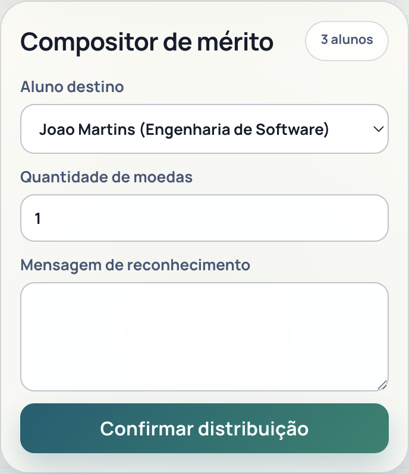
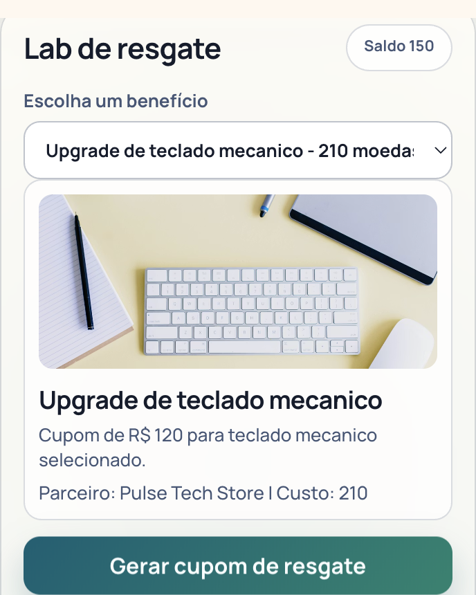
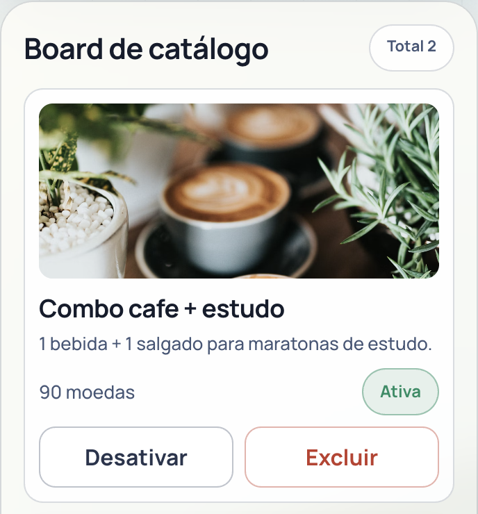

# Sistema de Moeda Estudantil

Arquitetura, tecnologias e fluxo completo de teste da aplicacao

- Backend: Java 21 + Spring Boot
- Frontend: React + TypeScript
- Persistencia: MongoDB
- Operacao: Docker Compose

---

# Tecnologias principais do frontend

- React 19 + TypeScript + React Router.
- Framer Motion para interacao e transicao visual.
- Cliente HTTP tipado para integracao com API.
- Build e qualidade com Vite + ESLint.

---

# Tecnologias principais do backend

- Java 21 + Spring Boot 3.5.
- Spring Security com token opaco e RBAC.
- Spring Data MongoDB para persistencia.
- Services, handlers globais e seed idempotente.

---

# Integracao Docker para teste completo

- `./docker/docker-start.sh` para subir frontend, backend e Mongo.
- `./docker/docker-e2e-routes-test.sh` para validar fluxo E2E.
- `./docker/docker-stop-clean.sh` para limpeza total do ambiente.
- Pipeline reproduzivel para demo e validacao tecnica.

---

# Problema e objetivo do produto

- Reconhecimento academico era informal e sem trilha consolidada.
- Alunos nao tinham uma visao unica de saldo e historico.
- Proposta: moeda digital com rastreabilidade completa.
- Resultado: incentivo real com resgate em parceiros.

---

# Arquitetura ponta a ponta

- Frontend SPA por papel (aluno, professor, parceiro).
- Backend em camadas com regras de negocio centralizadas.
- MongoDB com entidades e ledger append-only.
- API REST em `/api` com autenticacao por token.

---

# Fluxo 1: professor distribui moedas

- Professor seleciona aluno, valor e mensagem.
- Sistema valida permissao, saldo e destino.
- Saldo e historico sao atualizados no mesmo fluxo.
- Aluno visualiza credito no extrato.

---

# Fluxo 2: aluno resgata com cupom

- Aluno escolhe vantagem ativa.
- Sistema valida saldo e custo do item.
- Cupom unico e gerado e registrado no ledger.
- Parceiro usa o cupom para validar atendimento.

---

# Operacao do parceiro

- Edicao de perfil da empresa.
- Publicacao e manutencao de vantagens.
- Ativar, desativar e excluir itens do catalogo.
- Vitrine publica atualizada a cada alteracao.

---

# Persistencia e rastreabilidade

- Entidades centrais: Student, Professor, Partner e Benefit.
- Ledger em CoinTransaction com eventos de negocio.
- SessionToken para autenticacao com expiracao.
- Controle semestral idempotente por professor.

---

# Qualidade e evidencia de testes

- Build backend e frontend validados.
- E2E cobre autenticacao, autorizacao e regras criticas.
- Scripts Docker garantem ciclo completo de validacao.
- Execucao reproduzivel para banca e laboratorio.

---

# Conclusao e proximos passos

- Objetivo do Release 1 atingido com fluxos ponta a ponta funcionais.
- Plataforma pronta para demonstracao e coleta de feedback.
- Evolucoes sugeridas: SMTP real, rate limiting, observabilidade e app mobile.

