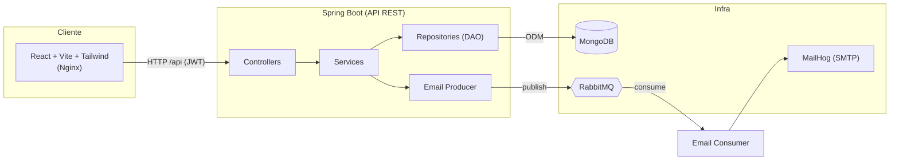
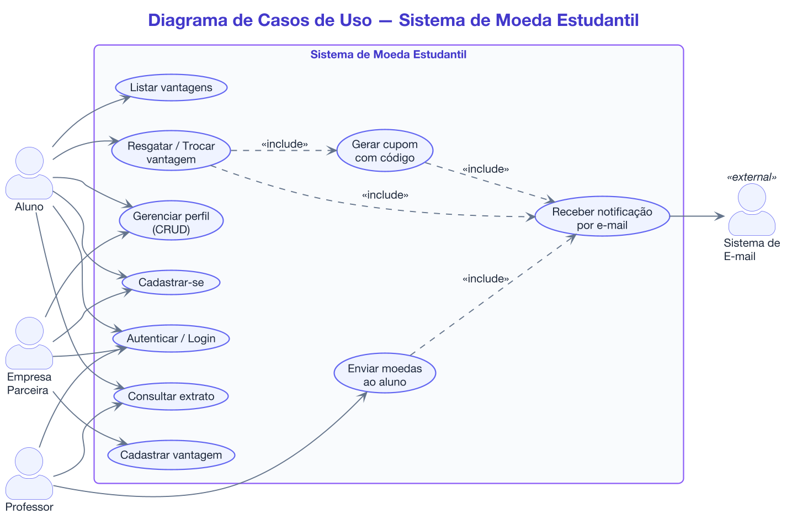
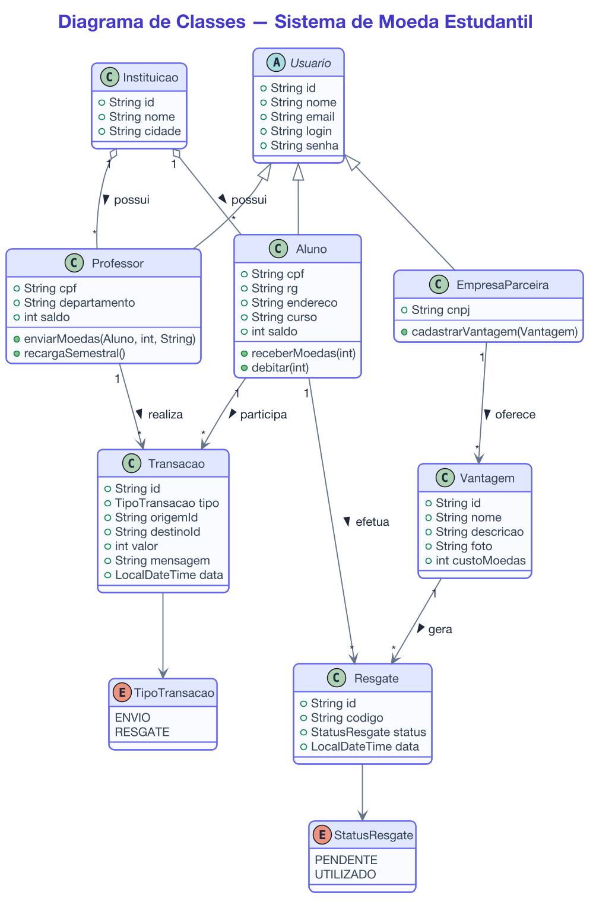
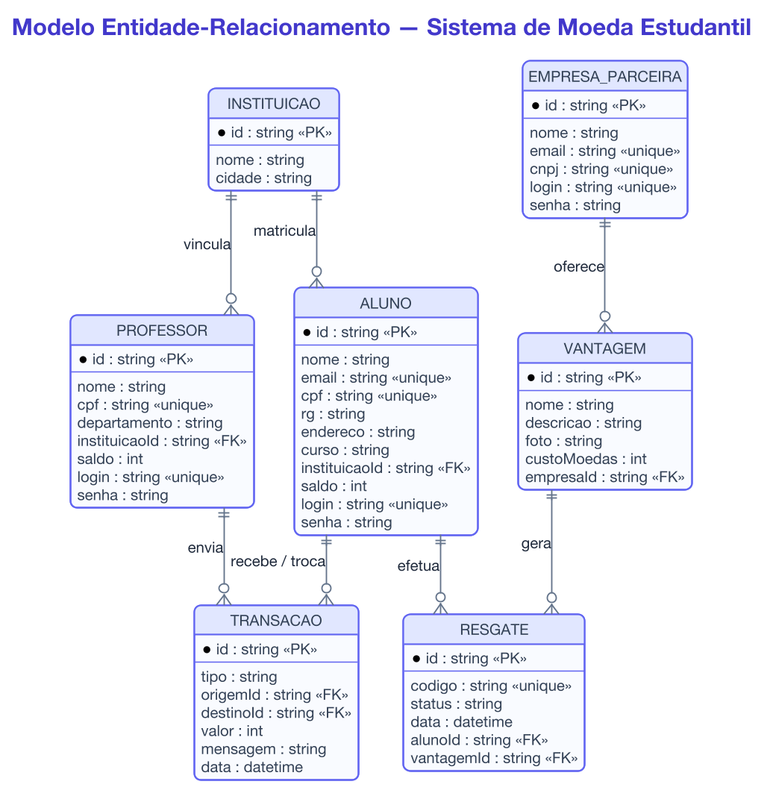
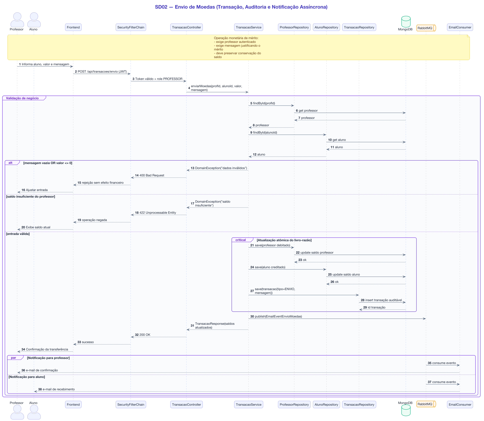
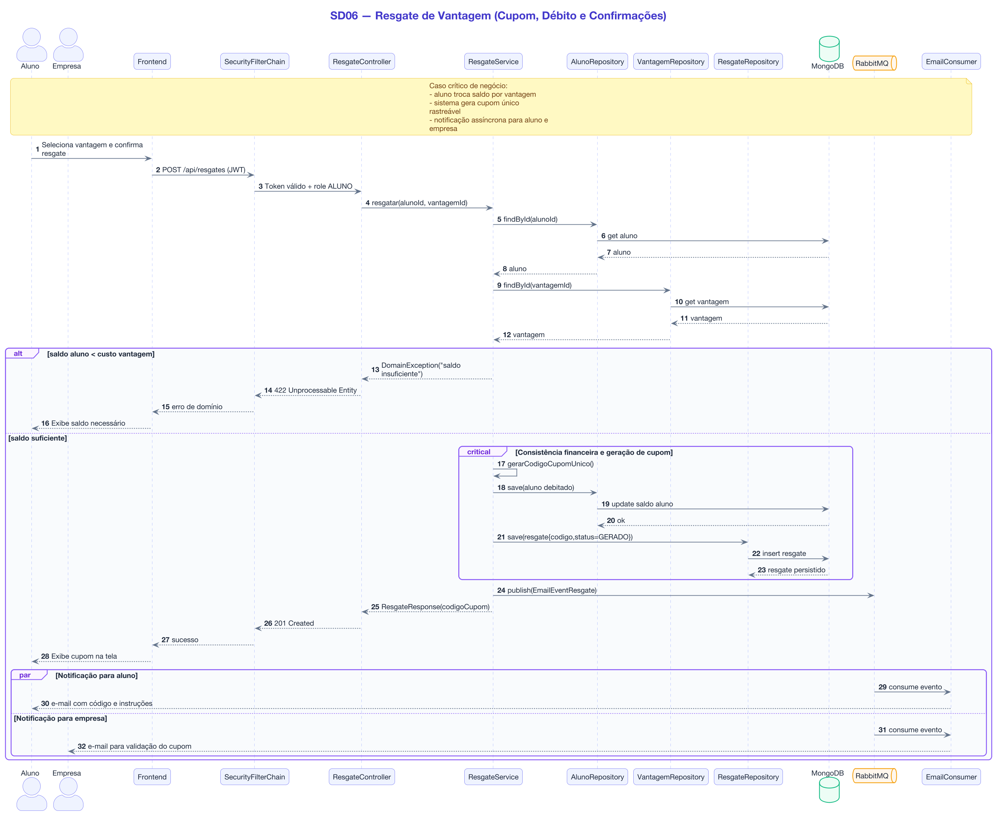

# 🪙 Sistema de Moeda Estudantil 👨‍💻

> Sistema de mérito estudantil baseado em moeda virtual: professores reconhecem alunos enviando moedas, e alunos trocam essas moedas por vantagens oferecidas por empresas parceiras.

<table>
  <tr>
    <td width="800px">
    <div align="justify">
      O <b>Sistema de Moeda Estudantil</b> é uma plataforma full-stack que implementa um programa de
      reconhecimento de mérito acadêmico inspirado no modelo de "moeda de reconhecimento". Cada
      <b>professor</b> recebe um valor semestral de moedas e pode distribuí-las aos <b>alunos</b> como forma
      de reconhecimento, sempre acompanhado de uma mensagem. Os alunos acumulam moedas e podem trocá-las por
      <b>vantagens</b> (descontos, produtos, serviços) oferecidas por <b>empresas parceiras</b>. Todo o fluxo
      é notificado por e-mail de forma assíncrona via mensageria. Projeto desenvolvido para a disciplina de
      <b>Laboratório de Desenvolvimento de Software</b> (PUC Minas).
    </div>
    </td>
    <td>
      <div>
        
      </div>
    </td>
  </tr>
</table>

---

## 🚧 Status do Projeto


---

## 📚 Índice

- [Sobre o Projeto](#-sobre-o-projeto)
- [Funcionalidades Principais](#-funcionalidades-principais)
- [Tecnologias Utilizadas](#-tecnologias-utilizadas)
- [Arquitetura](#-arquitetura)
- [Documentação (UML e Modelagem)](#-documentação-uml-e-modelagem)
- [Instalação e Execução](#-instalação-e-execução)
  - [Pré-requisitos](#pré-requisitos)
  - [Execução com Docker Compose (Recomendado)](#-execução-com-docker-compose-recomendado)
  - [Execução Manual (Desenvolvimento)](#-execução-manual-desenvolvimento)
  - [Variáveis de Ambiente](#-variáveis-de-ambiente)
- [Credenciais de Acesso (Seed)](#-credenciais-de-acesso-seed)
- [Endpoints da API](#-endpoints-da-api)
- [Estrutura de Pastas](#-estrutura-de-pastas)
- [Mapeamento das Entregas](#-mapeamento-das-entregas)
- [Autores](#-autores)
- [Licença](#-licença)

---

## 📝 Sobre o Projeto

Muitas instituições de ensino buscam formas de reconhecer o mérito e o bom desempenho dos alunos. Este
sistema digitaliza um **programa de moeda estudantil**, no qual o reconhecimento é representado por uma
moeda virtual.

**Como funciona:**

- Cada **professor** recebe **1.000 moedas por semestre**, que são **cumulativas** (saldo não utilizado é
  somado ao próximo semestre).
- O professor envia moedas a um aluno **sempre com uma mensagem** explicando o motivo do reconhecimento.
- O **aluno** acumula moedas e pode trocá-las por **vantagens** cadastradas por **empresas parceiras**
  (ex.: desconto na mensalidade, produtos, alimentação).
- A cada troca é gerado um **cupom com código único**, enviado por e-mail ao aluno e à empresa.
- Todas as partes (aluno, professor, empresa) acessam o sistema via **login e senha**.

**Contexto:** projeto acadêmico da disciplina de Laboratório de Desenvolvimento de Software, com foco em
modelagem (UML), arquitetura em camadas, persistência NoSQL, mensageria assíncrona e integração full-stack
containerizada.

---

## ✨ Funcionalidades Principais

- 🔐 **Autenticação por login/senha** com **JWT** para os três perfis (Aluno, Professor, Empresa).
- 👨‍🎓 **CRUD de Alunos** — cadastro autosserviço e gestão de dados (nome, email, CPF, RG, endereço, curso, instituição).
- 🏢 **CRUD de Empresas Parceiras** — cadastro e gestão.
- 🎁 **CRUD de Vantagens** — empresas cadastram vantagens com nome, descrição, foto e custo em moedas.
- 💸 **Envio de moedas** — professor envia moedas a alunos com mensagem obrigatória, validando saldo.
- 📜 **Extrato de transações** — aluno e professor consultam histórico de envios/recebimentos e saldo atual.
- 🔄 **Troca de vantagens** — aluno resgata vantagens, gerando **cupom com código único**.
- 📨 **Notificações por e-mail assíncronas** via **RabbitMQ**:
  - Aluno recebe e-mail ao **receber moedas**.
  - Professor recebe e-mail de **confirmação de envio**.
  - Aluno recebe e-mail com o **cupom** ao resgatar uma vantagem.
  - Empresa recebe e-mail com o **código para conferência** da troca.
- 🌱 **Seed automático** de instituições, professores, empresa e aluno para teste imediato.

---

## 🛠 Tecnologias Utilizadas

### 💻 Front-end

- **Biblioteca:** React 18.3
- **Linguagem:** JavaScript (ES6+) / JSX
- **Build Tool:** Vite 5.4
- **Estilização:** TailwindCSS 3.4
- **Roteamento:** React Router DOM 6
- **HTTP Client:** Axios
- **UI/UX:** lucide-react (ícones), react-hot-toast (feedback)

### 🖥️ Back-end

- **Linguagem/Runtime:** Java 21
- **Framework:** Spring Boot 3.4 (Web, Data MongoDB, AMQP, Mail, Security, Validation)
- **Banco de Dados:** MongoDB 7 (NoSQL)
- **Persistência (ODM/ORM):** Spring Data MongoDB (padrão Repository/DAO)
- **Mensageria:** RabbitMQ 3.13 (Spring AMQP)
- **E-mail:** Spring Mail + Thymeleaf (templates HTML) + MailHog (captura SMTP em dev)
- **Autenticação:** Spring Security + JWT (jjwt 0.12)

### ⚙️ Infraestrutura & DevOps

- **Containerização:** Docker + Docker Compose
- **Servidor Web (Front):** Nginx (serve build + proxy reverso `/api`)

---

## 🏗 Arquitetura

O sistema segue uma arquitetura **em camadas (MVC)** no back-end, com separação clara de responsabilidades e
os padrões **DTO**, **Service Layer**, **DAO/Repository** e **Producer/Consumer** (mensageria).


> Diagrama de implantação (Docker Compose). Demais diagramas em [Documentação](#-documentação-uml-e-modelagem).

<details>
<summary>Visão lógica em camadas (Mermaid)</summary>



</details>

**Fluxo de dados:**

1. O front-end consome a **API REST** autenticando com **JWT** (token no header `Authorization`).
2. Os **Controllers** recebem requisições, delegam aos **Services** (regras de negócio).
3. Os **Services** persistem via **Repositories** (Spring Data MongoDB) e publicam mensagens de e-mail no **RabbitMQ**.
4. Um **Consumer** processa as mensagens da fila e dispara os e-mails (renderizados com Thymeleaf), capturados pelo **MailHog** em ambiente de desenvolvimento.

**Padrões adotados:** MVC, Service Layer, Repository/DAO, DTO (records de request/response), Producer/Consumer (assíncrono), Exception Handler global.

---

## 📐 Documentação (UML e Modelagem)

Os diagramas e a modelagem do sistema estão na pasta [`docs/`](docs/):

| Documento | Descrição |
| :--- | :--- |
| [01 - Casos de Uso](docs/01-casos-de-uso.md) | Diagrama de casos de uso e atores |
| [02 - Histórias de Usuário](docs/02-historias-usuario.md) | User stories por perfil |
| [03 - Diagrama de Classes](docs/03-diagrama-classes.md) | Modelo de domínio |
| [04 - Diagrama de Componentes](docs/04-diagrama-componentes.md) | Visão de componentes/arquitetura |
| [05 - Modelo ER](docs/05-modelo-er.md) | Modelagem de dados (coleções) |
| [06 - Diagramas de Sequência](docs/06-diagramas-sequencia.md) | Fluxos de envio, troca e e-mail |

As imagens renderizadas (PNG/SVG) estão em [`docs/images`](docs/images) e os códigos-fonte dos
diagramas (PlantUML e Mermaid) em [`docs/diagrams`](docs/diagrams) — veja o
[guia de diagramas](docs/diagrams/README.md) para re-renderizar.

| | |
| :---: | :---: |
| **Casos de Uso** | **Classes** |
| [](docs/images/casos-de-uso.png) | [](docs/images/diagrama-classes.png) |
| **Componentes** | **Modelo ER** |
| [](docs/images/diagrama-componentes.png) | [](docs/images/modelo-er.png) |
| **Sequência — Envio de Moedas** | **Sequência — Resgate de Vantagem** |
| [](docs/images/seq-02-envio-moedas.png) | [](docs/images/seq-06-resgate-vantagem.png) |

---

## 🔧 Instalação e Execução

### Pré-requisitos

- **Docker** e **Docker Compose** (recomendado — sobe todo o ambiente)
- *Opcional para execução manual:* **Java 21**, **Maven 3.9+**, **Node.js 18+**

---

### 🐳 Execução com Docker Compose (Recomendado)

Sobe **todo o ambiente integrado** (MongoDB, RabbitMQ, MailHog, Back-end e Front-end) com um único comando.

1. Na raiz do projeto (onde está o `docker-compose.yml`):

```bash
docker compose up --build
```

2. Aguarde as imagens construírem e os containers ficarem saudáveis. Os serviços ficam disponíveis em:

| Serviço | URL | Observação |
| :--- | :--- | :--- |
| 🎨 **Front-end** | http://localhost:3000 | Interface da aplicação |
| 🖥️ **Back-end (API)** | http://localhost:8080 | API REST |
| 🐰 **RabbitMQ (Management)** | http://localhost:15672 | login: `guest` / `guest` |
| 📧 **MailHog (E-mails)** | http://localhost:8025 | Caixa de entrada dos e-mails enviados |
| 🍃 **MongoDB** | localhost:27017 | Banco de dados |

3. Para encerrar:

```bash
docker compose down
```

> 💡 Para apagar também os dados do MongoDB, use `docker compose down -v`.

---

### 💻 Execução Manual (Desenvolvimento)

Necessário ter MongoDB, RabbitMQ e um SMTP (ou MailHog) em execução. A forma mais simples é subir só a
infraestrutura via Docker e rodar back-end e front-end localmente:

```bash
# Sobe apenas a infraestrutura
docker compose up -d mongo rabbitmq mailhog
```

**Terminal 1 — Back-end (Spring Boot):**

```bash
cd backend
./mvnw spring-boot:run
# Back-end em http://localhost:8080
```

**Terminal 2 — Front-end (React + Vite):**

```bash
cd frontend
npm install
npm run dev
# Front-end em http://localhost:5173 (proxy /api -> 8080)
```

---

### 🔑 Variáveis de Ambiente

O back-end já possui *defaults* sensatos em [`backend/src/main/resources/application.yml`](backend/src/main/resources/application.yml).
No Docker Compose, as variáveis abaixo são injetadas automaticamente:

| Variável | Descrição | Valor (Docker) |
| :--- | :--- | :--- |
| `SPRING_DATA_MONGODB_URI` | URI de conexão do MongoDB | `mongodb://mongo:27017/moeda_estudantil` |
| `SPRING_RABBITMQ_HOST` | Host do RabbitMQ | `rabbitmq` |
| `SPRING_RABBITMQ_PORT` | Porta AMQP | `5672` |
| `SPRING_MAIL_HOST` | Host SMTP | `mailhog` |
| `SPRING_MAIL_PORT` | Porta SMTP | `1025` |

Front-end (Vite): `VITE_API_URL` (default `/api`, resolvido pelo proxy do Nginx/Vite).

---

## 🔐 Credenciais de Acesso (Seed)

No primeiro start, o `DataSeeder` popula o banco com dados de teste. Senha padrão: **`123456`**.

| Perfil | Login | Nome | Saldo inicial |
| :--- | :--- | :--- | :--- |
| 👨‍🏫 Professor | `professor` | João Paulo Aramuni | 1000 |
| 👨‍🏫 Professor | `maria` | Maria Silva | 1000 |
| 🏢 Empresa | `empresa` | Restaurante Universitário Sabor & Cia | — |
| 👨‍🎓 Aluno | `aluno` | Pedro Carbonaro | 50 |

**Instituições cadastradas:** PUC Minas (BH), UFMG (BH), CEFET-MG (BH), UNICAMP (Campinas).

---

## 🔌 Endpoints da API

Base: `http://localhost:8080/api`

| Método | Rota | Descrição | Auth |
| :--- | :--- | :--- | :---: |
| `POST` | `/auth/login` | Login (retorna JWT) | ❌ |
| `POST` | `/alunos` | Cadastrar aluno | ❌ |
| `GET` | `/alunos` | Listar alunos | ✅ |
| `GET` | `/alunos/{id}` | Buscar aluno | ✅ |
| `PUT` | `/alunos/{id}` | Atualizar aluno | ✅ |
| `DELETE` | `/alunos/{id}` | Remover aluno | ✅ |
| `POST` | `/empresas` | Cadastrar empresa | ❌ |
| `GET/PUT/DELETE` | `/empresas/...` | CRUD empresa | ✅ |
| `GET` | `/instituicoes` | Listar instituições | ❌ |
| `GET` | `/professores` | Listar professores | ✅ |
| `POST` | `/professores/recarga-semestral` | Recarregar +1000 moedas | ✅ |
| `POST` | `/transacoes/envio` | Professor envia moedas | ✅ |
| `GET` | `/transacoes/extrato/aluno/{id}` | Extrato do aluno | ✅ |
| `GET` | `/transacoes/extrato/professor/{id}` | Extrato do professor | ✅ |
| `POST/GET/PUT/DELETE` | `/vantagens/...` | CRUD de vantagens | ✅ |
| `POST` | `/resgates` | Aluno resgata vantagem | ✅ |
| `GET` | `/resgates/aluno/{id}` | Cupons do aluno | ✅ |
| `GET` | `/resgates/empresa/{id}` | Resgates recebidos pela empresa | ✅ |

---

## 📂 Estrutura de Pastas

```
LAB04/
├── docker-compose.yml          # 🐳 Orquestração (mongo, rabbitmq, mailhog, backend, frontend)
├── README.md                   # 📘 Este arquivo
├── docs/                       # 📚 Documentação UML e modelagem
│   ├── 01-casos-de-uso.md
│   ├── 02-historias-usuario.md
│   ├── 03-diagrama-classes.md
│   ├── 04-diagrama-componentes.md
│   ├── 05-modelo-er.md
│   ├── 06-diagramas-sequencia.md
│   ├── images/                 # 🖼️ Diagramas renderizados (PNG + SVG)
│   └── diagrams/               # 🎨 Código-fonte dos diagramas
│       ├── plantuml/           # Fontes .puml (UML profissional)
│       └── mermaid/            # Fontes .mmd (alternativa)
│
├── backend/                    # 📁 Aplicação Spring Boot
│   ├── Dockerfile
│   ├── pom.xml
│   └── src/main/
│       ├── java/com/puc/moedaestudantil/
│       │   ├── config/         # 🔧 RabbitMQ, DataSeeder
│       │   ├── controller/     # 🎮 Endpoints REST
│       │   ├── service/        # ⚙️ Regras de negócio
│       │   ├── repository/     # 🗄️ DAO (Spring Data MongoDB)
│       │   ├── model/          # 🧬 Entidades (documentos)
│       │   ├── dto/            # ✉️ Requests/Responses
│       │   ├── messaging/      # 📨 Producer/Consumer de e-mail
│       │   ├── security/       # 🛡️ JWT + Spring Security
│       │   └── exception/      # 💥 Handlers globais
│       └── resources/
│           ├── application.yml
│           └── templates/      # 🖼️ Templates de e-mail (Thymeleaf)
│
└── frontend/                   # 📁 Aplicação React
    ├── Dockerfile
    ├── nginx.conf              # 🌐 Serve build + proxy /api
    ├── package.json
    └── src/
        ├── api/                # 🔌 Cliente Axios
        ├── components/         # 🧱 Layout, UI, rotas protegidas
        ├── context/            # 🎣 AuthContext
        └── pages/              # 📄 Telas (login, cadastros, CRUDs, envio, extrato, vantagens, resgates)
```

---

## 🎯 Mapeamento das Entregas

| Entrega | Escopo | Status |
| :--- | :--- | :---: |
| **Lab03S01** | Casos de uso, histórias de usuário, diagrama de classes e de componentes | ✅ |
| **Lab03S02** | Modelo de dados, estratégia de persistência (DAO/ODM), CRUD de aluno e empresa (front + back) | ✅ |
| **Lab03S03** | CRUDs completos + arquitetura | ✅ |
| **Lab04S01** | Envio de moedas, extrato e e-mails (professor/aluno) | ✅ |
| **Lab04S02** | Diagramas de sequência + cadastro/listagem de vantagens | ✅ |
| **Lab04S03** | Diagrama de sequência geral + troca de vantagens (cupom + e-mails) | ✅ |

---

## 👥 Autores

| 👤 Nome | Função |
| :--- | :--- |
| Pedro Carbonaro | Desenvolvimento Full-stack |

---

## 📄 Licença

Projeto acadêmico distribuído sob a **Licença MIT**. Sinta-se livre para estudar e adaptar.
