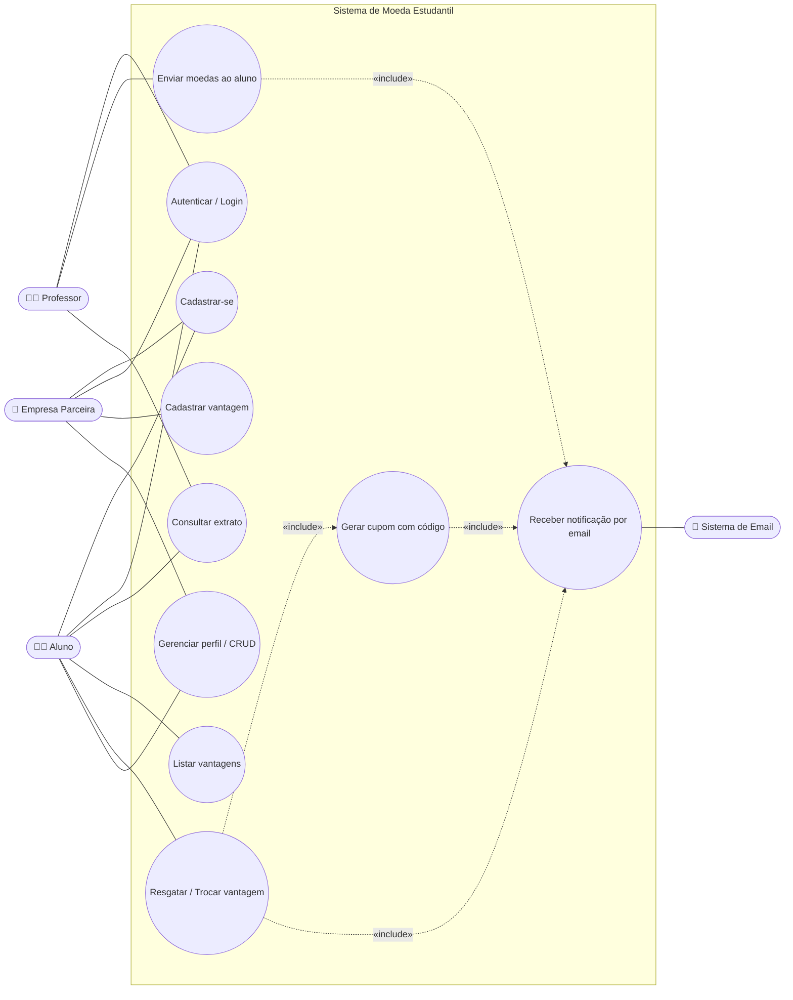

# Diagrama de Casos de Uso — Sistema de Moeda Estudantil

> Lab03S01 — Modelagem do sistema

## Atores

| Ator | Descrição |
|------|-----------|
| **Aluno** | Estudante cadastrado que recebe moedas de professores e troca por vantagens. |
| **Professor** | Docente pré-cadastrado que distribui moedas como reconhecimento de mérito. |
| **Empresa Parceira** | Empresa que oferece vantagens (produtos/descontos) trocáveis por moedas. |
| **Instituição de Ensino** | Entidade pré-cadastrada à qual alunos e professores estão vinculados. |
| **Sistema de Email** | Ator externo responsável pelo envio das notificações e cupons. |

## Diagrama

> Imagem gerada com PlantUML. Fonte: [`diagrams/plantuml/casos-de-uso.puml`](diagrams/plantuml/casos-de-uso.puml) · versão vetorial: [`images/casos-de-uso.svg`](images/casos-de-uso.svg)

Código Mermaid (visualização alternativa)

## Especificação resumida dos casos de uso

### UC01 — Cadastrar-se
- **Atores:** Aluno, Empresa Parceira
- **Pré-condições:** Instituições já pré-cadastradas (para alunos).
- **Fluxo principal:** O ator informa seus dados (aluno: nome, email, CPF, RG, endereço, instituição, curso; empresa: nome, email, CNPJ). O sistema valida e persiste o cadastro, gerando login/senha.
- **Pós-condições:** Conta criada; aluno inicia com saldo 0.

### UC02 — Autenticar / Login
- **Atores:** Aluno, Professor, Empresa.
- **Fluxo principal:** O ator informa login e senha; o sistema valida as credenciais e emite um token JWT.

### UC03 — Enviar moedas ao aluno
- **Ator:** Professor.
- **Pré-condições:** Professor autenticado e com saldo suficiente.
- **Fluxo principal:** O professor seleciona o aluno, informa a quantidade e uma **mensagem obrigatória** com o motivo. O sistema debita o saldo do professor, credita ao aluno e registra a transação.
- **Inclui:** UC08 (notifica aluno por email).

### UC04 — Consultar extrato
- **Atores:** Professor, Aluno.
- **Fluxo principal:** O sistema apresenta o saldo atual e o histórico de transações (professor: envios; aluno: recebimentos e trocas).

### UC05 — Cadastrar vantagem
- **Ator:** Empresa Parceira.
- **Fluxo principal:** A empresa informa nome, descrição, foto e custo em moedas. O sistema persiste a vantagem.

### UC06 — Listar vantagens
- **Ator:** Aluno.
- **Fluxo principal:** O sistema lista as vantagens disponíveis com descrição, foto e custo.

### UC07 — Resgatar / Trocar vantagem
- **Ator:** Aluno.
- **Pré-condições:** Aluno autenticado e com saldo suficiente.
- **Fluxo principal:** O aluno seleciona a vantagem; o sistema debita o custo do saldo, registra o resgate e gera um cupom com código.
- **Inclui:** UC09 (gera cupom) e UC08 (envia email ao aluno e ao parceiro).

### UC08 — Receber notificação por email
- **Ator externo:** Sistema de Email.
- **Fluxo principal:** O sistema publica um evento na fila (RabbitMQ); o consumidor monta o template e dispara o email.

### UC09 — Gerar cupom com código
- **Fluxo principal:** O sistema gera um código único de conferência, anexado aos emails do aluno e do parceiro.
