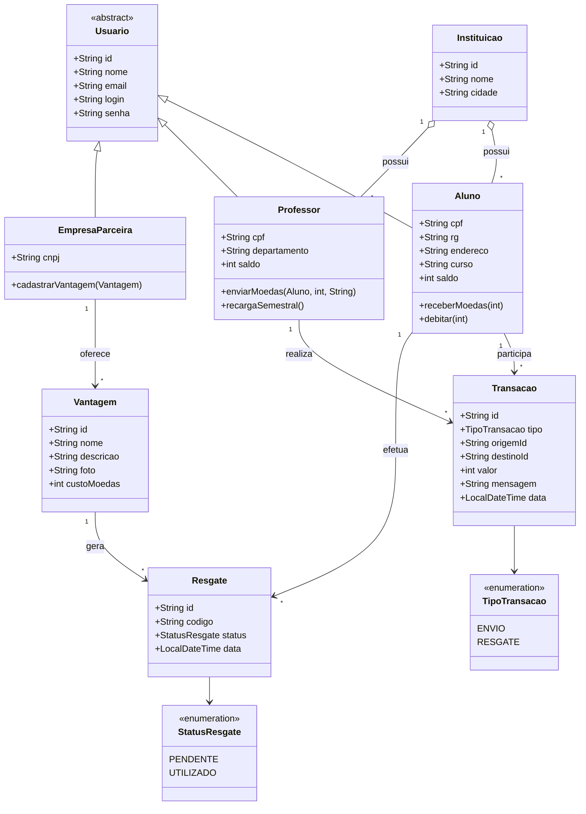

# Diagrama de Classes — Sistema de Moeda Estudantil

> Lab03S01 — Modelagem do sistema

> Imagem gerada com PlantUML. Fonte: [`diagrams/plantuml/diagrama-classes.puml`](diagrams/plantuml/diagrama-classes.puml) · versão vetorial: [`images/diagrama-classes.svg`](images/diagrama-classes.svg)

Código Mermaid (visualização alternativa)

## Observações de modelagem

- `Usuario` é uma **superclasse abstrata** com os atributos e credenciais comuns. `Aluno`, `Professor` e `EmpresaParceira` herdam dela.
- O **saldo** de moedas é mantido em `Aluno` e `Professor`. A empresa não possui saldo.
- `Transacao` registra tanto o **envio** (professor → aluno) quanto o **resgate** (aluno → vantagem), diferenciado pelo enum `TipoTransacao`.
- `Resgate` materializa o cupom gerado, com `codigo` único e `status`.
- No MongoDB, as associações são representadas por **referências por id** (ex.: `instituicaoId`, `empresaId`), exceto valores fortemente acoplados que podem ser embutidos.
