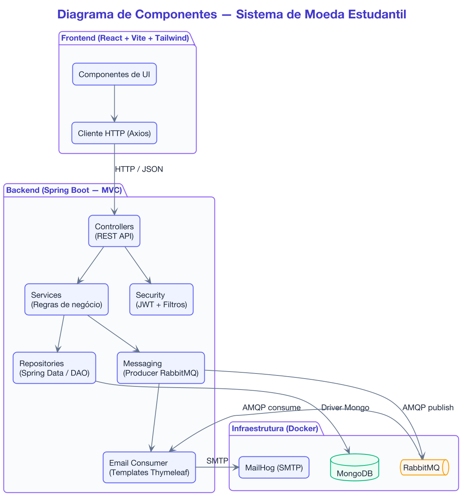
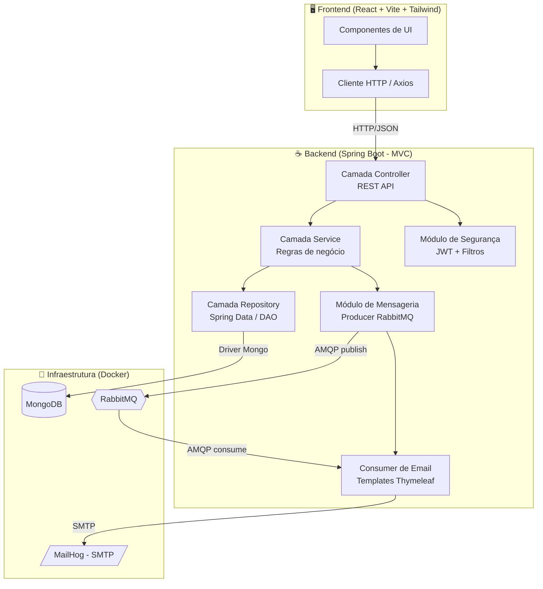
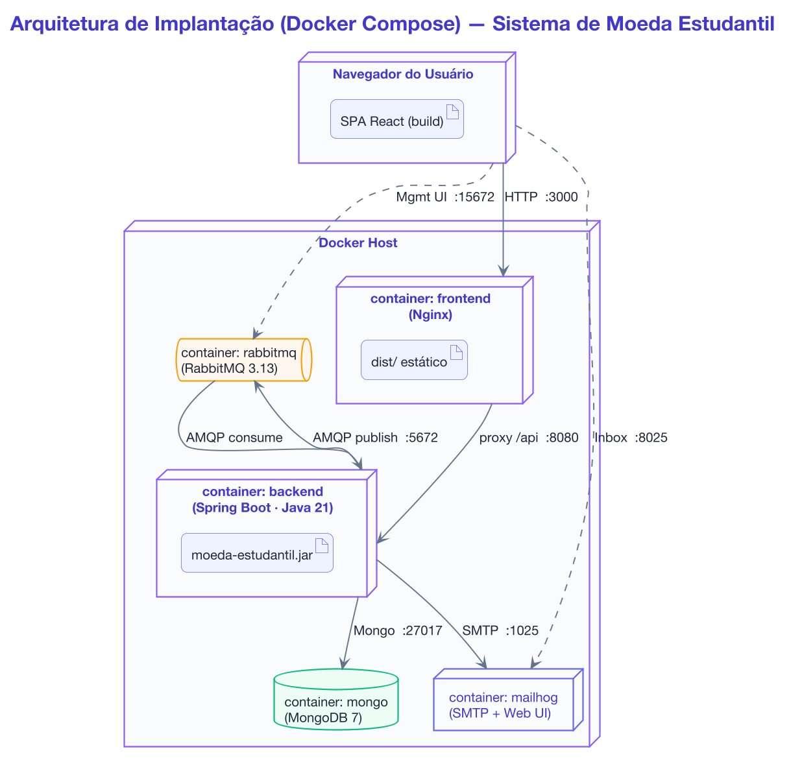

# Diagrama de Componentes — Sistema de Moeda Estudantil

> Lab03S01 — Modelagem do sistema

> Imagem gerada com PlantUML. Fonte: [`diagrams/plantuml/diagrama-componentes.puml`](diagrams/plantuml/diagrama-componentes.puml) · versão vetorial: [`images/diagrama-componentes.svg`](images/diagrama-componentes.svg)

Código Mermaid (visualização alternativa)

## Arquitetura de implantação (Docker Compose)

> Diagrama de implantação dos containers Docker. Fonte: [`diagrams/plantuml/arquitetura.puml`](diagrams/plantuml/arquitetura.puml) · versão vetorial: [`images/arquitetura.svg`](images/arquitetura.svg)

## Descrição dos componentes

| Componente | Responsabilidade |
|------------|------------------|
| **Frontend (React)** | Interface do usuário, formulários de CRUD, telas de envio de moedas, extrato, vantagens e resgate. Consome a API REST. |
| **Controller** | Expõe os endpoints REST, recebe requisições, valida entradas e delega aos services. |
| **Service** | Concentra as regras de negócio (saldo, envio de moedas, resgate, recarga semestral). |
| **Repository (DAO)** | Abstrai o acesso ao MongoDB via Spring Data. |
| **Security (JWT)** | Autenticação e autorização por papel (aluno, professor, empresa). |
| **Messaging (Producer)** | Publica eventos de notificação na fila do RabbitMQ. |
| **Email Consumer** | Consome eventos da fila e envia emails com templates (professor, aluno, cupom). |
| **MongoDB** | Banco de dados de documentos para persistência. |
| **RabbitMQ** | Broker de mensagens para desacoplar o envio de emails. |
| **MailHog** | Servidor SMTP de testes para inspeção dos emails em ambiente de desenvolvimento. |

## Estilo arquitetural

O sistema adota o padrão **MVC** com separação em camadas (Controller → Service → Repository) e
comunicação **assíncrona** para envio de emails via RabbitMQ, garantindo baixo acoplamento entre o
processamento das transações e a entrega das notificações.
