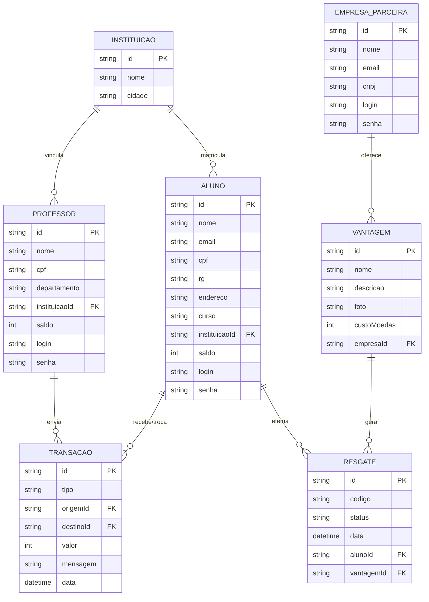

# Modelo ER / Modelo de Dados — Sistema de Moeda Estudantil

> Lab03S02 — Modelo ER e estratégia de persistência

Embora o MongoDB seja orientado a documentos (NoSQL), o modelo lógico das entidades e seus
relacionamentos pode ser representado no formato Entidade-Relacionamento abaixo. No banco, cada
entidade corresponde a uma **collection** e os relacionamentos são mantidos por **referências de id**.

> Imagem gerada com PlantUML. Fonte: [`diagrams/plantuml/modelo-er.puml`](diagrams/plantuml/modelo-er.puml) · versão vetorial: [`images/modelo-er.svg`](images/modelo-er.svg)

Código Mermaid (visualização alternativa)

## Estratégia de acesso ao banco de dados

- **Tecnologia:** MongoDB + **Spring Data MongoDB** (mapeamento objeto-documento, equivalente a um ORM/ODM).
- **Padrão DAO:** cada entidade possui um `Repository` (interface que estende `MongoRepository`),
  isolando o acesso a dados da lógica de negócio.
- **Mapeamento:** anotações `@Document`, `@Id` e `@Indexed(unique = true)` definem collections,
  chaves e restrições de unicidade (ex.: CPF, email, login).
- **Relacionamentos:** mantidos por referência de id (`instituicaoId`, `empresaId`, etc.),
  resolvidos na camada de service quando necessário.

## Collections

| Collection | Entidade | Chaves únicas |
|------------|----------|---------------|
| `instituicoes` | Instituição | — |
| `alunos` | Aluno | cpf, email, login |
| `professores` | Professor | cpf, login |
| `empresas` | Empresa Parceira | cnpj, email, login |
| `vantagens` | Vantagem | — |
| `transacoes` | Transação | — |
| `resgates` | Resgate | codigo |
