# Diagramas de Sequência — Sistema de Moeda Estudantil

> Lab04S02 (um por caso de uso) e Lab04S03 (diagrama geral)

## Diagrama de Sequência Geral

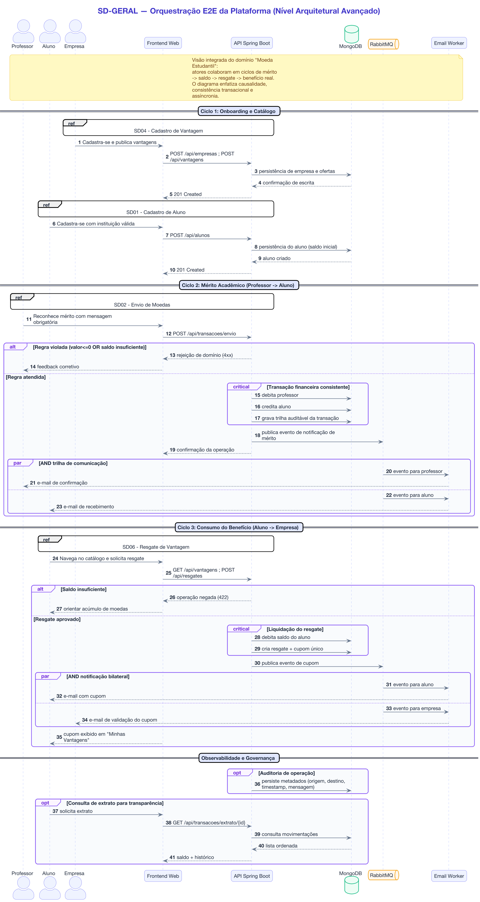

> Fonte principal: [`diagrams/plantuml/seq-07-visao-geral.puml`](diagrams/plantuml/seq-07-visao-geral.puml) · versão vetorial: [`images/diagrama-sequencia.svg`](images/diagrama-sequencia.svg)

## SD01 — Cadastro de Aluno

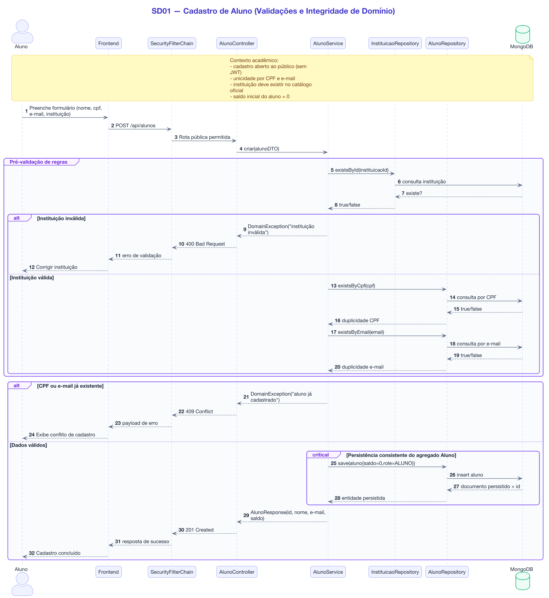

> Fonte: [`diagrams/plantuml/seq-01-cadastro-aluno.puml`](diagrams/plantuml/seq-01-cadastro-aluno.puml)

Código Mermaid

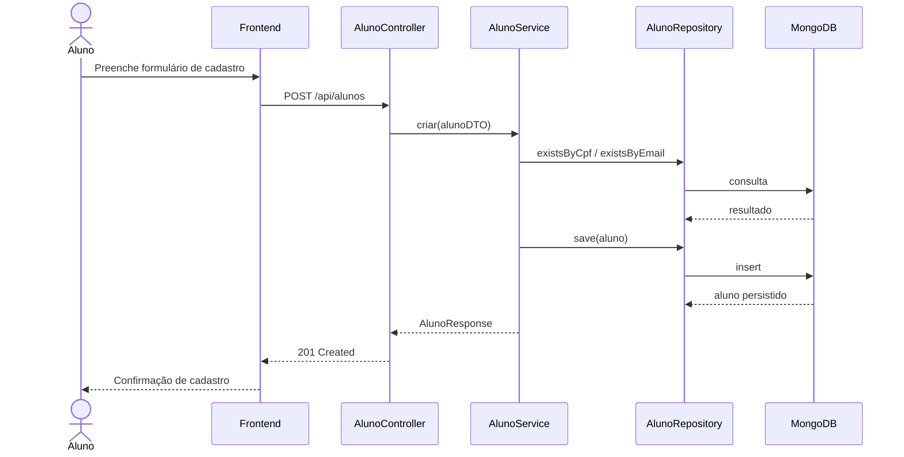

## SD02 — Envio de Moedas (Professor → Aluno)

> Fonte: [`diagrams/plantuml/seq-02-envio-moedas.puml`](diagrams/plantuml/seq-02-envio-moedas.puml)

Código Mermaid

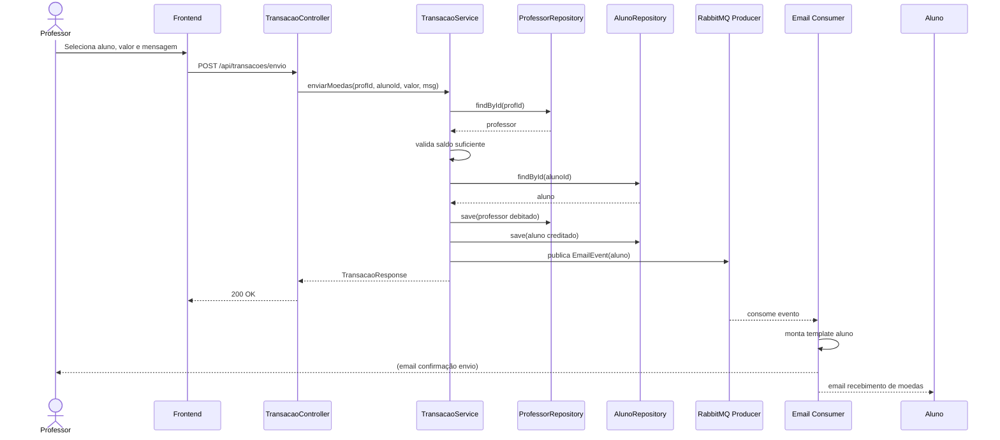

## SD03 — Consulta de Extrato

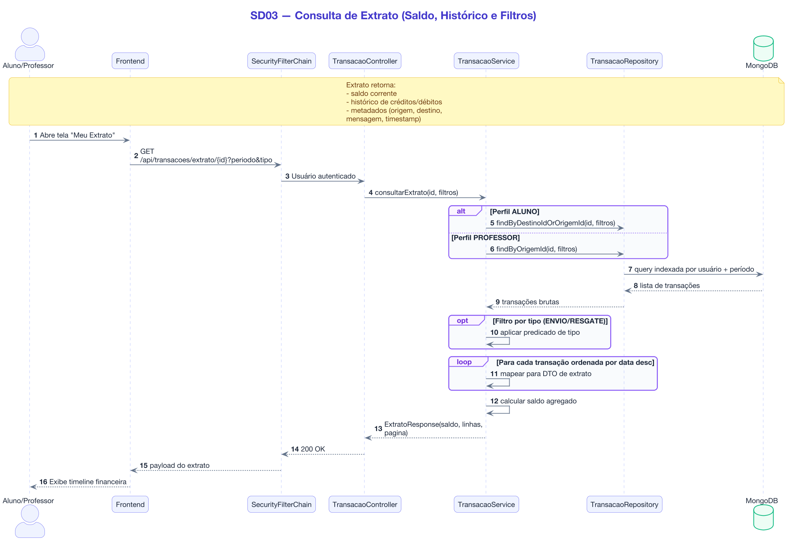

> Fonte: [`diagrams/plantuml/seq-03-extrato.puml`](diagrams/plantuml/seq-03-extrato.puml)

Código Mermaid

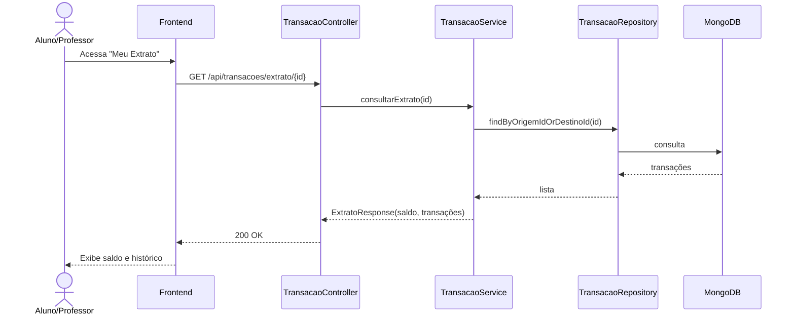

## SD04 — Cadastro de Vantagem (Empresa)

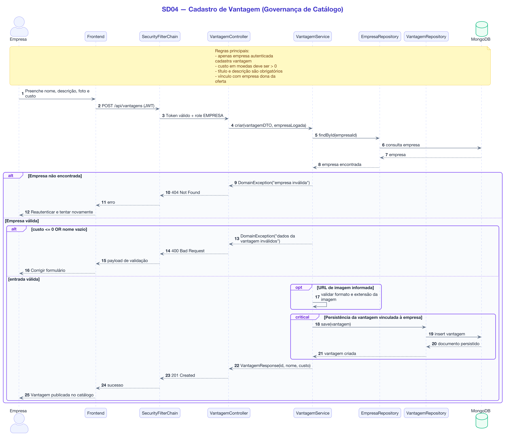

> Fonte: [`diagrams/plantuml/seq-04-cadastro-vantagem.puml`](diagrams/plantuml/seq-04-cadastro-vantagem.puml)

Código Mermaid

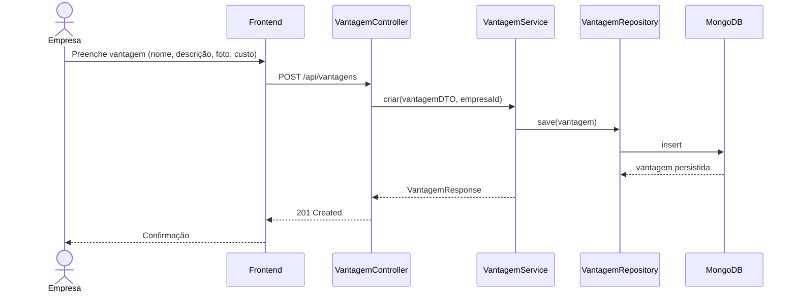

## SD05 — Listagem de Vantagens (Aluno)

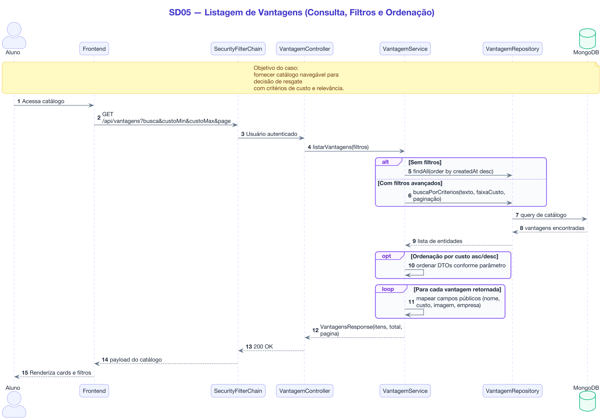

> Fonte: [`diagrams/plantuml/seq-05-listagem-vantagens.puml`](diagrams/plantuml/seq-05-listagem-vantagens.puml)

Código Mermaid

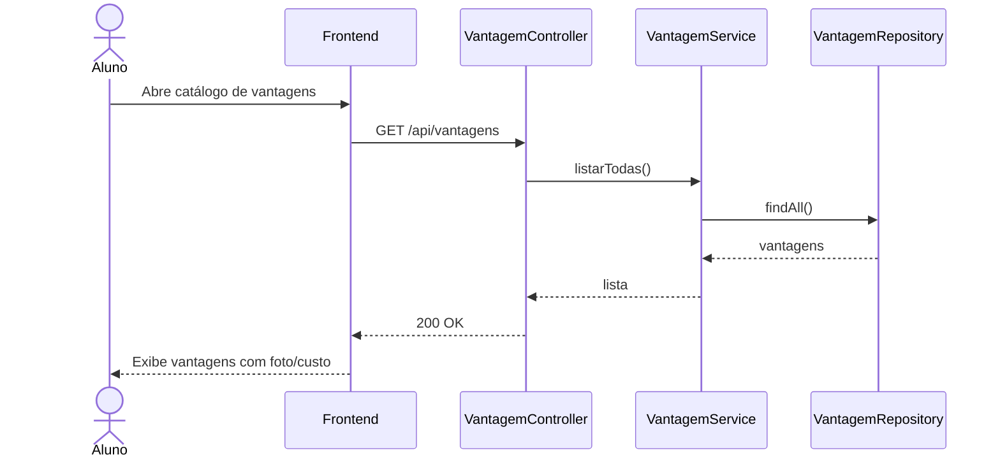

## SD06 — Resgate / Troca de Vantagem (Aluno)

> Fonte: [`diagrams/plantuml/seq-06-resgate-vantagem.puml`](diagrams/plantuml/seq-06-resgate-vantagem.puml)

Código Mermaid

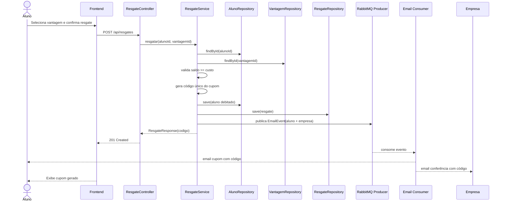

## SD-GERAL — Visão geral do fluxo (Lab04S03)

> Fonte: [`diagrams/plantuml/seq-07-visao-geral.puml`](diagrams/plantuml/seq-07-visao-geral.puml)

Código Mermaid

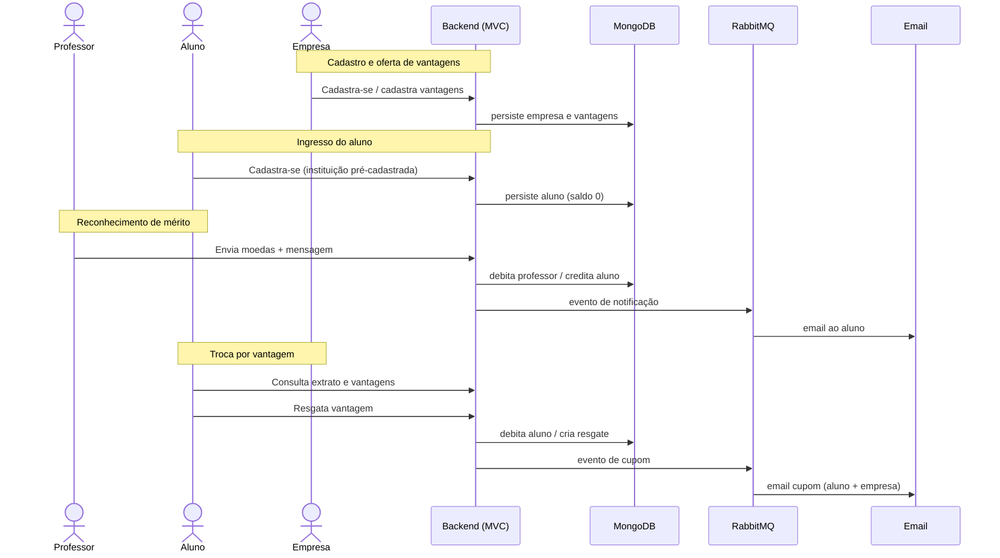

